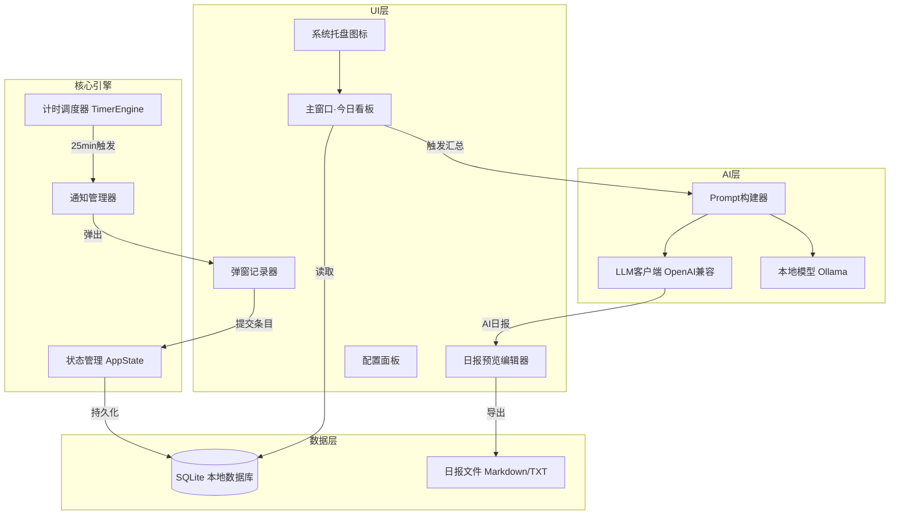

## 需求分析与软件设计文档 —— POMATO 番茄日志助手

---

## 一、背景与痛点深挖

| 维度 | 问题描述 |
|------|----------|
| 记忆负担 | 下班后回忆全天工作，信息遗漏、顺序混乱 |
| 情绪障碍 | 疲惫状态下写日志，质量低、易拖延 |
| 碎片化 | 工作本身被打断，但无结构化记录载体 |
| 汇总低效 | 手工分类整理耗时，格式不一致 |
| 价值感缺失 | 不清楚自己一天做了多少事，成就感低 |

---

## 二、用户故事（User Stories）

```
作为用户，我希望软件自动在工作时间启动计时，不需要我手动触发
作为用户，每25分钟被弹窗提醒，我只需要花30秒记录刚才做了什么
作为用户，休息5分钟后自动进入下一轮，无需手动操作
作为用户，随时可以查看今日已记录的内容
作为用户，下班前一键生成日报，AI帮我分类汇总
作为用户，可以编辑AI生成的日报后再导出
作为用户，历史日报可以查阅和搜索
```

---

## 三、功能需求规格

### 3.1 核心模块

```
POMATO
├── F1 计时引擎
├── F2 弹窗记录
├── F3 今日看板
├── F4 AI汇总引擎
├── F5 日报输出
└── F6 配置中心
```

### F1 计时引擎

| 需求ID | 描述 | 优先级 |
|--------|------|--------|
| F1-01 | 每日自动在用户设定时间（默认8:30）启动 | P0 |
| F1-02 | 工作时段25分钟（可配置） | P0 |
| F1-03 | 休息时段5分钟（可配置） | P0 |
| F1-04 | 每4个番茄钟后触发长休息15分钟 | P1 |
| F1-05 | 计时状态：系统托盘图标实时显示倒计时 | P1 |
| F1-06 | 支持手动暂停/跳过/重置当前番茄钟 | P1 |
| F1-07 | 非工作日/节假日自动不启动（可配置日历） | P2 |

### F2 弹窗记录（核心交互）

| 需求ID | 描述 | 优先级 |
|--------|------|--------|
| F2-01 | 25分钟到点后弹窗置顶，强制获取焦点 | P0 |
| F2-02 | 输入框：自由文本描述过去25分钟工作内容 | P0 |
| F2-03 | 快捷标签选择：项目/类别（可自定义标签） | P1 |
| F2-04 | "跳过本轮"按钮（会议中/离开等场景） | P0 |
| F2-05 | 输入后一键提交，窗口自动关闭，进入休息 | P0 |
| F2-06 | 休息结束提醒窗口（轻量，可直接关闭） | P1 |
| F2-07 | 支持键盘快捷键提交（Ctrl+Enter） | P1 |
| F2-08 | 弹窗出现时播放提示音（可开关） | P2 |
| F2-09 | 超时未处理（3分钟）自动标记为"未记录" | P2 |

### F3 今日看板

| 需求ID | 描述 | 优先级 |
|--------|------|--------|
| F3-01 | 主界面展示当日所有条目（时间轴形式） | P0 |
| F3-02 | 显示已完成番茄数、总工作时长 | P1 |
| F3-03 | 支持手动编辑/删除已记录条目 | P1 |
| F3-04 | 支持手动添加条目（补录） | P1 |

### F4 AI汇总引擎

| 需求ID | 描述 | 优先级 |
|--------|------|--------|
| F4-01 | 将全天碎片记录发送给AI，生成结构化日报 | P0 |
| F4-02 | AI输出：按项目/类别分类、要点提炼、时长统计 | P0 |
| F4-03 | 支持自定义日报模板（Prompt可配置） | P1 |
| F4-04 | 支持本地大模型（Ollama）和云端API（OpenAI/通义等）| P1 |
| F4-05 | AI结果可编辑后再导出 | P0 |
| F4-06 | 无网络时可跳过AI直接导出原始条目 | P1 |

### F5 日报输出

| 需求ID | 描述 | 优先级 |
|--------|------|--------|
| F5-01 | 导出为Markdown文件 | P0 |
| F5-02 | 导出为纯文本（可直接粘贴到钉钉/飞书） | P0 |
| F5-03 | 一键复制到剪贴板 | P0 |
| F5-04 | 导出为Word/PDF（可选） | P2 |
| F5-05 | 历史日报列表查阅与搜索 | P1 |

### F6 配置中心

| 配置项 | 默认值 |
|--------|--------|
| 工作开始时间 | 08:30 |
| 番茄时长 | 25分钟 |
| 短休息时长 | 5分钟 |
| 长休息时长 | 15分钟 |
| 长休息间隔番茄数 | 4 |
| AI接口类型 | OpenAI兼容 |
| API Key / Base URL | 用户填写 |
| 日报模板 | 默认模板 |
| 自定义标签 | 可增删 |
| 开机自启动 | 开启 |
| 提示音 | 开启 |

---

## 四、非功能需求

| 类别 | 要求 |
|------|------|
| 性能 | 弹窗响应 < 500ms，AI汇总 < 30s |
| 轻量 | 内存占用 < 100MB，安装包 < 50MB |
| 离线 | 计时和记录功能完全离线可用 |
| 数据安全 | 数据存本地SQLite，不强制上云 |
| 兼容性 | Windows 10/11 主要支持，Mac可选 |
| 可靠性 | 意外关闭后重启自动恢复当日状态 |

---

## 五、系统架构设计



---

## 六、数据模型

```sql
-- 番茄条目表
CREATE TABLE pomodoro_entries (
    id          INTEGER PRIMARY KEY AUTOINCREMENT,
    date        TEXT NOT NULL,           -- 2025-06-01
    session_no  INTEGER NOT NULL,        -- 当日第几个番茄
    start_time  TEXT NOT NULL,           -- 08:30:00
    end_time    TEXT NOT NULL,           -- 08:55:00
    content     TEXT,                    -- 用户输入内容
    tags        TEXT,                    -- JSON数组 ["项目A","开发"]
    skipped     INTEGER DEFAULT 0,       -- 是否跳过
    created_at  TEXT NOT NULL
);

-- 日报表
CREATE TABLE daily_reports (
    id           INTEGER PRIMARY KEY AUTOINCREMENT,
    date         TEXT UNIQUE NOT NULL,
    raw_entries  TEXT NOT NULL,          -- JSON快照
    ai_summary   TEXT,                   -- AI生成内容
    final_report TEXT,                   -- 用户编辑后最终版
    exported_at  TEXT,
    created_at   TEXT NOT NULL
);

-- 配置表
CREATE TABLE settings (
    key   TEXT PRIMARY KEY,
    value TEXT NOT NULL
);
```

---

## 七、UI/UX 关键设计

### 弹窗设计（最重要的交互）
```
┌─────────────────────────────────────┐
│  🍅 第 3 个番茄钟完成！             │
│─────────────────────────────────────│
│  过去25分钟，你做了什么？           │
│                                     │
│  ┌───────────────────────────────┐  │
│  │ 完成了用户登录模块的单元测试   │  │
│  │ 修复了两个边界case bug         │  │
│  └───────────────────────────────┘  │
│                                     │
│  标签: [开发✓] [测试✓] [会议] [文档]│
│                                     │
│  [跳过本轮]        [✓ 提交 Ctrl+↵] │
└─────────────────────────────────────┘
```

### 日报输出示例
```markdown
# 工作日报 2025-06-01

## 📊 今日概览
- 完成番茄钟：8个（约4小时专注时间）
- 工作时段：08:30 - 17:45

## 🔧 开发工作（4个番茄钟）
- 完成用户登录模块单元测试，修复边界case 2处
- 重构数据访问层，提升查询性能约30%

## 📝 文档与沟通（2个番茄钟）
- 更新API接口文档v2.1
- 参与项目周会，确认下周排期

## 🐛 问题处理（1个番茄钟）
- 排查并修复生产环境日志异常告警

## 💡 待跟进
- 性能优化方案待评审
```

---

## 八、技术选型推荐

| 层次 | 推荐方案 | 理由 |
|------|----------|------|
| **桌面框架** | **Python + PyQt6** | 轻量、弹窗控制强、开发快、Windows打包成熟 |
| 数据库 | SQLite（内置） | 零配置，本地文件，可靠 |
| 计时 | QTimer + schedule | PyQt自带，精度足够 |
| 系统托盘 | PyQt6 QSystemTrayIcon | 原生支持 |
| 窗口置顶 | Win32 API（pywin32） | 确保弹窗强制置顶 |
| AI客户端 | openai SDK | 兼容所有OpenAI格式API |
| 打包 | PyInstaller | 打包为单个exe |

> **备选：** 如需更好跨平台体验可用 **Tauri（Rust+前端）**，但开发成本更高。

---

## 九、实现路线图

```
阶段 1 — MVP（2-3周）
├── 计时引擎 + 弹窗记录（离线核心功能）
├── SQLite数据存储
├── 今日看板（简单列表）
└── 原始条目导出为文本

阶段 2 — AI集成（1-2周）
├── AI汇总接入（OpenAI兼容接口）
├── 日报预览与编辑器
└── Markdown/文本导出

阶段 3 — 完善体验（持续迭代）
├── 配置面板UI
├── 历史日报查阅
├── 自定义标签管理
├── 开机自启动
└── 安装包打包（exe）
```

---

## 十、风险与建议

| 风险 | 建议 |
|------|------|
| 弹窗打断心流 | 增加"专注勿扰模式"，允许推迟10分钟弹出 |
| AI汇总质量不稳定 | Prompt中注入日期、标签等结构化上下文；允许重新生成 |
| 用户懒得输入 | 弹窗要极简，支持"重复上一条"快捷按钮 |
| 数据丢失 | 每日自动备份SQLite到同目录 |
| API Key安全 | Key存储于本地加密配置文件，不明文存储 |

---

**建议下一步：** 确认技术栈（Python/PyQt6 推荐），我可以直接开始搭建 MVP 骨架代码，包含计时引擎、弹窗组件和数据层。是否开始实现？

---

## 十一、User Story & Task 完成状态追踪

> 图例：✅ 已完成  ⚠️ 部分完成（后端实现/UI未接入）  ❌ 未实现
>
> 对应代码位置见括号标注。

---

### US-1 自动计时，无需手动触发

> "作为用户，我希望软件在工作时间自动开始计时，到点自动弹窗，休息后自动进入下一轮"

| Task ID | 描述 | 状态 | 代码位置 |
|---------|------|------|----------|
| US1-T1 | 工作/短休/长休 状态机 | ✅ | `timer_engine.py` · `TimerState` |
| US1-T2 | 每日到达设定时间自动启动（默认 08:30） | ✅ | `timer_engine.py` · `_on_tick` |
| US1-T3 | 仅工作日（周一~五）自动启动 | ✅ | `timer_engine.py` · `now.weekday() < 5` |
| US1-T4 | 每4个番茄钟触发长休息 | ✅ | `timer_engine.py` · `_handle_session_end` |
| US1-T5 | 托盘图标实时倒计时 tooltip | ✅ | `tray_manager.py` · `_on_tick` |
| US1-T6 | 托盘菜单状态文字（工作中/休息中） | ✅ | `tray_manager.py` · `status_action` |
| US1-T7 | 手动开始按钮（今日看板） | ✅ | `main_window.py` · `start_btn` |
| US1-T8 | 暂停 / 继续（后端已实现，UI未接入） | ✅ | `tray_manager.py` · `pause_action` / `_on_pause_resume` |
| US1-T9 | 跳过当前休息（后端已实现，UI未接入） | ✅ | `tray_manager.py` · `skip_break_action` |
| US1-T10 | 节假日不自动启动（可配置日历） | ❌ | — |

---

### US-2 25分钟弹窗记录，30秒完成输入

> "作为用户，每25分钟被弹窗提醒，我只需花30秒记录刚才做了什么"

| Task ID | 描述 | 状态 | 代码位置 |
|---------|------|------|----------|
| US2-T1 | 工作时段结束自动触发弹窗 | ✅ | `tray_manager.py` · `_on_work_session_ended` |
| US2-T2 | 弹窗强制置顶、抢占焦点 | ✅ | `popup_window.py` · `show_and_focus` / `ctypes` |
| US2-T3 | 自由文本输入框 | ✅ | `popup_window.py` · `QTextEdit` |
| US2-T4 | 多选标签（来自配置） | ✅ | `popup_window.py` · `tag_buttons` |
| US2-T5 | "跳过本轮"按钮 | ✅ | `popup_window.py` · `_on_skip` |
| US2-T6 | Ctrl+Enter 快捷键提交 | ✅ | `popup_window.py` · `QShortcut` |
| US2-T7 | 提交后自动关闭、进入休息计时 | ✅ | `popup_window.py` · `accept()` → timer 继续 |
| US2-T8 | 休息结束托盘气泡通知 | ✅ | `tray_manager.py` · `_on_break_ended` |
| US2-T9 | 弹窗提示音 | ✅ | `tray_manager.py` · `winsound.MessageBeep` |
| US2-T10 | 超时3分钟自动标记"未记录" | ✅ | `popup_window.py` + `tray_manager.py` |
| US2-T11 | "重复上一条"快捷按钮 | ✅ | `popup_window.py` + `database.py` |

---

### US-3 随时查看今日工作记录

> "作为用户，随时可以查看今日已记录的内容"

| Task ID | 描述 | 状态 | 代码位置 |
|---------|------|------|----------|
| US3-T1 | 今日条目时间轴列表展示 | ✅ | `main_window.py` · `EntryItem` |
| US3-T2 | 已完成番茄钟数量统计 | ✅ | `main_window.py` · `pomodoro_count` |
| US3-T3 | 总专注时长统计（分钟） | ✅ | `main_window.py` · `focus_time` label |
| US3-T4 | 双击托盘图标打开主窗口 | ✅ | `tray_manager.py` · `_on_tray_activated` |
| US3-T5 | 关闭主窗口最小化到托盘 | ✅ | `main_window.py` · `closeEvent` |
| US3-T6 | 条目内联编辑 UI | ✅ | `main_window.py` · `EditEntryDialog` / `_on_edit_entry` |
| US3-T7 | 条目删除 UI | ✅ | `main_window.py` · `_on_delete_entry` |
| US3-T8 | 手动补录条目（填写时间段+内容） | ✅ | `main_window.py` · `AddEntryDialog` / `_on_add_entry` |

---

### US-4 一键 AI 汇总，生成结构化日报

> "作为用户，下班前一键生成日报，AI帮我分类汇总"

| Task ID | 描述 | 状态 | 代码位置 |
|---------|------|------|----------|
| US4-T1 | OpenAI 兼容 API 对接 | ✅ | `ai_client.py` · `AIClient` |
| US4-T2 | Prompt 构建（注入日期/标签/时长） | ✅ | `ai_client.py` · `build_prompt` |
| US4-T3 | 流式输出（打字机效果） | ✅ | `report_window.py` · `_AIWorker` + `chunk_received` |
| US4-T4 | AI 失败时兜底展示原始记录 | ✅ | `report_window.py` · `_on_error` / `_generate_fallback` |
| US4-T5 | 重新生成按钮 | ✅ | `report_window.py` · `regenerate_btn` |
| US4-T6 | 自定义 Prompt 模板（UI配置） | ✅ | `settings_window.py` + `ai_client.py` |
| US4-T7 | Ollama 本地模型一键切换 | ✅ | `settings_window.py` · `_apply_ollama_profile` |
| US4-T8 | 日报存入数据库（可查历史） | ✅ | `database.py` · `save_report` |

---

### US-5 编辑并导出日报

> "作为用户，可以编辑AI生成的日报后再导出"

| Task ID | 描述 | 状态 | 代码位置 |
|---------|------|------|----------|
| US5-T1 | 日报全文可编辑（富文本框） | ✅ | `report_window.py` · `self.editor` |
| US5-T2 | 导出为 Markdown 文件（.md） | ✅ | `report_window.py` · `_export_markdown` |
| US5-T3 | 一键复制到剪贴板 | ✅ | `report_window.py` · `_copy_to_clipboard` |
| US5-T4 | 导出为纯文本（钉钉/飞书直接粘贴格式） | ✅ | `report_window.py` · `_markdown_to_plain_text` |
| US5-T5 | 历史日报列表 UI（按日期查阅） | ✅ | `history_window.py` · `HistoryWindow` |
| US5-T6 | 日报内容搜索 | ✅ | `history_window.py` + `database.py` · `search_reports` |
| US5-T7 | 导出 Word / PDF | ❌ | P2 优先级 |

---

### US-6 个性化配置

> "作为用户，我希望能自定义工作时间、番茄钟时长、AI接口等参数"

| Task ID | 描述 | 状态 | 代码位置 |
|---------|------|------|----------|
| US6-T1 | 计时参数配置（开始时间/番茄时长/休息时长） | ✅ | `settings_window.py` + `config.py` |
| US6-T2 | AI 接口配置（Base URL / Key / 模型名） | ✅ | `settings_window.py` |
| US6-T3 | 配置持久化到 JSON 文件 | ✅ | `config.py` · `~/.pomato/config.json` |
| US6-T4 | 提示音开关配置 | ✅ | `settings_window.py` · `sound_enabled`（存储） |
| US6-T5 | 自定义标签增删 UI | ✅ | `settings_window.py` · `tag_list` / `_add_tag` / `_del_tag` |
| US6-T6 | 开机自启动 | ✅ | `settings_window.py` + `config.py`（Windows Run 注册表） |
| US6-T7 | API Key 加密存储（非明文） | ✅ | `config.py`（DPAPI/XOR 加密落盘） |

---

### 非功能需求完成情况

| NFR | 描述 | 状态 | 备注 |
|-----|------|------|------|
| NFR-01 | 离线可用（计时+记录） | ✅ | 仅 AI 汇总需联网 |
| NFR-02 | 数据本地 SQLite | ✅ | `~/.pomato/pomato.db` |
| NFR-03 | 意外关闭后恢复当日数据 | ✅ | `timer_engine.py` · `restore_session_no()` 启动时调用 |
| NFR-04 | 轻量内存 < 100MB | 未测试 | — |
| NFR-05 | 安装包打包（exe） | ❌ | PyInstaller 配置未建立 |

---

### 完成度汇总

| 模块 | 总 Task 数 | ✅ 已完成 | ⚠️ 部分 | ❌ 未实现 |
|------|-----------|----------|---------|----------|
| US-1 计时引擎 | 10 | 9 | 0 | 1 |
| US-2 弹窗记录 | 11 | 11 | 0 | 0 |
| US-3 今日看板 | 8 | 8 | 0 | 0 |
| US-4 AI汇总 | 8 | 8 | 0 | 0 |
| US-5 日报导出 | 7 | 6 | 0 | 1 |
| US-6 配置中心 | 7 | 7 | 0 | 0 |
| NFR | 5 | 3 | 0 | 2 |
| **合计** | **56** | **52 (93%)** | **0 (0%)** | **4 (7%)** |

---

### 下一步优先建议（按价值/成本排序）

| 优先级 | Task | 预估工作量 |
|--------|------|-----------|
| 🔴 高 | US1-T10 节假日不自动启动（可配置日历） | 3h |
| 🟡 中 | US5-T7 导出 Word / PDF | 2h |
| 🟡 中 | NFR-04 轻量内存 < 100MB 压测与优化 | 2h |
| 🟢 低 | NFR-05 打包为 .exe（PyInstaller） | 2h |