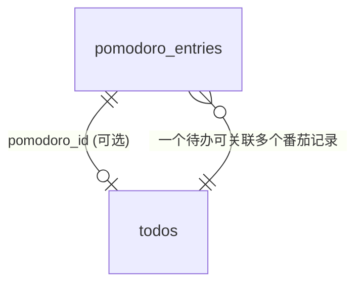

# POMATO 待办与提醒功能 —— 需求分析与技术设计文档

> **版本**: v1.0  
> **日期**: 2026-06-08  
> **状态**: 待评审  
> **关联项目**: POMATO 番茄日志助手（Python 3.13 + PyQt6 + SQLite）

---

## 目录

- [第一部分：市场需求分析文档 (MRD)](#第一部分市场需求分析文档-mrd)
  - [1. 需求来源与背景](#1-需求来源与背景)
  - [2. 目标用户画像](#2-目标用户画像)
  - [3. 核心用户故事](#3-核心用户故事)
  - [4. 功能需求规格](#4-功能需求规格)
  - [5. 非功能需求](#5-非功能需求)
  - [6. 竞品分析与差异化](#6-竞品分析与差异化)
  - [7. 成功指标](#7-成功指标)
  - [8. 风险与应对](#8-风险与应对)
- [第二部分：技术设计文档 (TSD)](#第二部分技术设计文档-tsd)
  - [9. 架构概览](#9-架构概览)
  - [10. 数据模型设计](#10-数据模型设计)
  - [11. 核心模块设计](#11-核心模块设计)
  - [12. UI/UX 设计](#12-uiux-设计)
  - [13. 与现有系统的集成](#13-与现有系统的集成)
  - [14. 实现路线图](#14-实现路线图)
  - [15. 测试策略](#15-测试策略)

---

# 第一部分：市场需求分析文档 (MRD)

---

## 1. 需求来源与背景

### 1.1 原始用户需求

> **"支持设置待办，支持到点提醒"**

### 1.2 需求深挖 —— 用户真正想要什么？

用户已经在用 POMATO 管理番茄钟计时和碎片化工作记录，但存在以下痛点：

| 痛点维度 | 具体表现 | 根因分析 |
|----------|----------|----------|
| **意图缺失** | 能记录"做了什么"，但无法提前规划"要做什么" | 缺少计划层——有记录无规划 |
| **时间盲区** | 番茄钟只管专注时段，会议/截止时间等固定时间点事件无法管理 | 缺少日历提醒能力 |
| **优先级混乱** | 一天开始不知道从哪件事入手，结束才发现重要的事没做 | 缺乏优先级排序和可视化 |
| **信息割裂** | 待办在别的 App（记事本/Todoist/钉钉），番茄记录在 POMATO | 工作流不闭环 |
| **遗忘风险** | 沉浸工作时容易忘记会议、忘记喝水、忘记某个时间点该做的事 | 缺少到点强提醒机制 |

### 1.3 一句话价值主张

> **让 POMATO 从"记录你做了什么"升级为"帮你规划并提醒该做什么"——计划、计时、记录、提醒，一个 App 闭环。**

---

## 2. 目标用户画像

| 画像 | 特征 | 典型场景 |
|------|------|----------|
| **独立开发者** | 一人多角色，无人提醒，容易沉浸过深忘记会议和时间节点 | "下午3点要和客户 demo，但写代码写着写着就忘了" |
| **远程办公者** | 在家工作，缺乏办公室环境的时间锚点 | "没人走过来说'开会了'，全靠自己记" |
| **知识工作者** | 任务碎片化，多个项目并行 | "今天有5件事要做，哪件先做？做了几件？" |
| **学生/研究人员** | 论文、实验、课程多项并行 | "论文修改截止时间是周五，但今天周三了还没开始" |

---

## 3. 核心用户故事

```
US-T1  作为用户，我希望上班前能快速列出今天要做的事，按优先级排列
US-T2  作为用户，在番茄钟弹窗记录时，能一键将正在做的待办标记为完成
US-T3  作为用户，我可以为重要事项设定具体提醒时间（如15:00 开会），到点强弹窗提醒
US-T4  作为用户，某条待办超时未完成时，自动顺延或提示是否继续
US-T5  作为用户，今日看板同时展示「待办列表」+「已完成记录」，一目了然
US-T6  作为用户，AI日报能引用今日待办的完成情况（完成了 X/Y 项计划任务）
US-T7  作为用户，支持重复提醒（每日站会 09:30、每周五周报 17:00）
US-T8  作为用户，未完成的待办自动结转至次日，不丢失
```

---

## 4. 功能需求规格

### 模块 F7：待办管理 (To-Do Management)

| 需求ID | 描述 | 优先级 | 用户故事 |
|--------|------|--------|----------|
| F7-01 | 创建待办：标题、优先级（高/中/低）、截止日期、备注 | P0 | US-T1 |
| F7-02 | 待办列表展示：按优先级排序，支持拖拽调整顺序 | P0 | US-T1 |
| F7-03 | 待办状态：待开始 / 进行中 / 已完成 | P0 | US-T2 |
| F7-04 | 番茄弹窗中显示当前待办列表，支持一键勾选完成 | P1 | US-T2 |
| F7-05 | 手动标记完成/取消完成 | P1 | — |
| F7-06 | 编辑/删除待办 | P1 | — |
| F7-07 | 待办关联番茄钟条目（某条记录属于哪个待办） | P2 | — |

### 模块 F8：定时提醒 (Scheduled Reminders)

| 需求ID | 描述 | 优先级 | 用户故事 |
|--------|------|--------|----------|
| F8-01 | 创建提醒：标题、提醒时间、是否重复、重复规则 | P0 | US-T3 |
| F8-02 | 到点强弹窗提醒（置顶+提示音+托盘气泡） | P0 | US-T3 |
| F8-03 | 提醒弹窗支持"知道了"/"延后10分钟"操作 | P0 | — |
| F8-04 | 支持一次性提醒和重复提醒（每日/每周/工作日） | P1 | US-T7 |
| F8-05 | 提醒列表管理：查看/编辑/删除/启用禁用 | P1 | — |
| F8-06 | 提醒与番茄钟计时互不冲突（弹窗排队机制） | P0 | — |
| F8-07 | 提醒错过时（如电脑关机）下次启动补提醒 | P2 | — |

### 模块 F9：今日看板增强（新 UI 融合）

| 需求ID | 描述 | 优先级 | 用户故事 |
|--------|------|--------|----------|
| F9-01 | 看板顶部区域：待办卡片列表 | P0 | US-T5 |
| F9-02 | 看板中部区域：提醒时间线 | P1 | — |
| F9-03 | 看板底部区域：番茄钟记录（现有功能增强） | P0 | — |
| F9-04 | 标题栏显示"待办完成进度 X/Y" | P1 | — |
| F9-05 | 未完成待办自动结转至次日（可关闭） | P2 | US-T8 |

### 模块 F10：AI 日报增强

| 需求ID | 描述 | 优先级 |
|--------|------|--------|
| F10-01 | Prompt 中注入今日待办完成情况 | P1 |
| F10-02 | 日报摘要显示"计划 X 项，完成 Y 项，完成率 Z%" | P1 |

---

## 5. 非功能需求

| 类别 | 要求 |
|------|------|
| **性能** | 提醒触发延迟 < 1s（基于 1s tick）；待办列表 200 条以内渲染 < 100ms |
| **可靠性** | 提醒不因番茄钟状态机阻塞而丢失；异常退出后提醒数据不丢 |
| **数据一致** | 待办与番茄条目关联关系保持引用完整性 |
| **内存** | 新增模块后内存增长 < 10MB（目标总 < 60MB） |
| **兼容性** | 不影响现有番茄钟计时、弹窗记录、AI 日报功能 |
| **扩展性** | 待办可独立使用（不强制启动番茄计时） |

---

## 6. 竞品分析与差异化

| 竞品 | 番茄钟 | 待办 | 提醒 | 日报 | 本地+离线 |
|------|--------|------|------|------|-----------|
| **Todoist** | ❌ | ✅ | ✅ | ❌ | ❌ 云端 |
| **TickTick** | ✅ | ✅ | ✅ | ❌ | ❌ 云端 |
| **番茄ToDo** | ✅ | ✅ | ❌ | ❌ | 部分 |
| **Forest** | ✅ | ❌ | ❌ | ❌ | ✅ |
| **POMATO v2.0** | ✅ | ✅ | ✅ | ✅ AI | ✅ 本地 |

> **POMATO 核心差异化优势**：番茄计时 + 待办规划 + 定时提醒 + AI 日报 → **一站式本地工作流闭环**，无需联网即可完成"计划-执行-记录-总结"全流程。

---

## 7. 成功指标

| 指标 | 目标值 | 衡量方式 |
|------|--------|----------|
| 待办创建频率 | 日活用户日均创建 ≥3 条 | DB 统计 |
| 待办完成率 | ≥60% 的待办在截止日前完成 | DB 统计 |
| 提醒准时率 | 100%（1s 误差内） | 日志 |
| 弹窗冲突率 | <1%（提醒弹窗与番茄弹窗冲突） | 日志 |
| 功能可用率 | 不与现有功能互斥 | 全量回归测试通过 |

---

## 8. 风险与应对

| 风险 | 概率 | 影响 | 应对策略 |
|------|------|------|----------|
| 提醒弹窗与番茄完成弹窗同时触发 | 中 | 用户困扰 | 弹窗队列机制：先进先出，最多排队 2 个 |
| 待办过多导致界面卡顿 | 低 | 体验差 | 虚拟列表 + 分页 + 默认收起已完成 |
| 提醒在非工作时间触发 | 低 | 骚扰 | 允许设置"工作时间外静默" |
| 用户觉得功能太多变复杂 | 中 | 弃用 | 模块化显示：默认折叠待办/提醒区，按需展开 |

---

# 第二部分：技术设计文档 (TSD)

---

## 9. 架构概览

### 9.1 现有架构回顾

```
┌─────────────────────────────────────────────────────────┐
│  主线程 (Qt Event Loop)                                  │
│                                                         │
│  QTimer (1s) ──→ TimerEngine._on_tick()                 │
│                   ├── IDLE: 检查是否启动番茄钟            │
│                   ├── WORK: 倒计时 → 到期触发弹窗         │
│                   └── BREAK: 倒计时 → 到期开始新番茄      │
│                                                         │
│  TrayManager ──→ 信号接线 + 弹窗 + 主窗口生命周期         │
│  MainWindow  ──→ 今日看板 UI + 增删改查                  │
│  Database    ──→ SQLite 同步读写（主线程，无连接池）       │
│  Config      ──→ JSON 文件持久化 (~/.pomato/config.json) │
│                                                         │
│  临时线程: _AIWorker(QThread) —— 仅在生成日报时创建       │
└─────────────────────────────────────────────────────────┘
```

### 9.2 新增模块架构

```
                            ┌─────────────────────┐
                            │   ReminderEngine    │  ← 新增
                            │  (QObject, 无独立线程) │
                            │                     │
                            │  - 待办 CRUD        │
                            │  - 提醒调度          │
                            │  - 自动结转          │
                            └──────┬──────────────┘
                                   │
       ┌───────────────────────────┼───────────────────────────┐
       │                           │                           │
       ▼                           ▼                           ▼
┌──────────────┐          ┌──────────────┐          ┌──────────────┐
│  Database    │          │ TimerEngine  │          │ TrayManager  │
│  (新增3表)   │          │ (复用1s tick) │          │ (新增信号)   │
└──────────────┘          └──────────────┘          └──────────────┘
       │                                                   │
       ▼                                                   ▼
┌──────────────┐                                  ┌──────────────┐
│  待办+提醒    │                                  │ 提醒弹窗      │
│  SQLite 表   │                                  │ ReminderPopup │
└──────────────┘                                  └──────────────┘
```

**关键设计决策：零新线程**

- `ReminderEngine` 复用 `TimerEngine` 现有的 1s QTimer tick，不在每次 tick 中做数据库查询
- 在 tick 中仅做**内存比较**（当前时间 vs 已加载的提醒列表），O(n) 扫描 n 条提醒（通常 < 20 条），耗时 < 0.1ms
- 弹窗冲突通过**队列机制**解决，不引入线程同步复杂度

---

## 10. 数据模型设计

### 10.1 新增表：`todos`（待办事项）

```sql
CREATE TABLE IF NOT EXISTS todos (
    id          INTEGER PRIMARY KEY AUTOINCREMENT,
    title       TEXT    NOT NULL,             -- 待办标题
    priority    INTEGER NOT NULL DEFAULT 1,   -- 0=低 1=中 2=高
    status      TEXT    NOT NULL DEFAULT 'pending',  -- pending | in_progress | done
    due_date    TEXT,                         -- 截止日期 (YYYY-MM-DD)，可空
    note        TEXT    DEFAULT '',           -- 备注
    sort_order  INTEGER NOT NULL DEFAULT 0,   -- 拖拽排序序号
    pomodoro_id INTEGER,                      -- 关联的番茄钟条目 ID（可空）
    created_at  TEXT    NOT NULL,
    updated_at  TEXT    NOT NULL,
    FOREIGN KEY (pomodoro_id) REFERENCES pomodoro_entries(id) ON DELETE SET NULL
);

CREATE INDEX IF NOT EXISTS idx_todos_status ON todos(status);
CREATE INDEX IF NOT EXISTS idx_todos_due_date ON todos(due_date);
```

### 10.2 新增表：`reminders`（定时提醒）

```sql
CREATE TABLE IF NOT EXISTS reminders (
    id          INTEGER PRIMARY KEY AUTOINCREMENT,
    title       TEXT    NOT NULL,             -- 提醒标题
    remind_time TEXT    NOT NULL,             -- 提醒时间 (HH:MM 格式)
    repeat_type TEXT    NOT NULL DEFAULT 'none',  -- none | daily | weekly | weekday
    repeat_days TEXT    DEFAULT '',           -- weekly 时存放 "1,3,5" (周几)
    enabled     INTEGER NOT NULL DEFAULT 1,   -- 是否启用
    snooze_min  INTEGER NOT NULL DEFAULT 10,  -- 延后分钟数
    last_triggered TEXT,                      -- 上次触发日期，防同一天重复触发
    created_at  TEXT    NOT NULL,
    updated_at  TEXT    NOT NULL
);

CREATE INDEX IF NOT EXISTS idx_reminders_enabled ON reminders(enabled);
```

### 10.3 新增配置项（`config.json` 新增 key）

```json
{
    "todo_auto_carry_over": true,
    "reminder_silent_outside_work": false,
    "reminder_popup_timeout_seconds": 120,
    "show_completed_todos": true
}
```

### 10.4 与现有表的关联关系



> `todos.pomodoro_id` 字段当用户在番茄弹窗中标记某待办为完成时写入，实现待办与番茄记录的弱关联。

---

## 11. 核心模块设计

### 11.1 `src/reminder_engine.py` —— 新增核心模块

```python
"""
reminder_engine.py — 待办管理 + 定时提醒引擎

设计原则：
- 零新线程，复用 TimerEngine 的 1s QTimer tick
- 内存中维护已加载的提醒列表，tick 时仅做时间比较
- 提醒触发信号通过 TrayManager 连接到弹窗
"""

from datetime import datetime, date, time
from enum import Enum
from PyQt6.QtCore import QObject, pyqtSignal


class TodoStatus(str, Enum):
    PENDING = "pending"
    IN_PROGRESS = "in_progress"
    DONE = "done"


class RepeatType(str, Enum):
    NONE = "none"
    DAILY = "daily"
    WEEKLY = "weekly"
    WEEKDAY = "weekday"


class ReminderEngine(QObject):
    # ---- 信号 ----

    # 提醒触发：(reminder_id, title, remind_time_str)
    reminder_triggered = pyqtSignal(int, str, str)

    # 待办变更通知
    todos_changed = pyqtSignal()


    def __init__(self, config, db):
        super().__init__()
        self.config = config
        self.db = db
        self._reminders: list[dict] = []   # 内存缓存
        self._triggered_today: set[int] = set()
        self._reload_reminders()

    # ================================================================
    # 提醒管理
    # ================================================================

    def _reload_reminders(self):
        """从 DB 重载所有启用的提醒到内存。"""
        today = date.today().isoformat()
        self._reminders = self.db.get_enabled_reminders()
        # 重建今日已触发集合
        self._triggered_today = {
            r["id"] for r in self._reminders
            if r.get("last_triggered") == today
        }

    def add_reminder(self, title, remind_time, repeat_type="none",
                     repeat_days="", snooze_min=10):
        rid = self.db.add_reminder(title, remind_time, repeat_type,
                                   repeat_days, snooze_min)
        self._reload_reminders()
        return rid

    def update_reminder(self, reminder_id, **kwargs):
        self.db.update_reminder(reminder_id, **kwargs)
        self._reload_reminders()

    def delete_reminder(self, reminder_id):
        self.db.delete_reminder(reminder_id)
        self._reload_reminders()

    def snooze_reminder(self, reminder_id):
        """延后提醒（默认 10 分钟）。"""
        r = self.db.get_reminder(reminder_id)
        if not r:
            return
        snooze_min = r.get("snooze_min", 10)
        now = datetime.now()
        new_time = (now.hour * 60 + now.minute + snooze_min) % (24 * 60)
        h, m = divmod(new_time, 60)
        new_time_str = f"{h:02d}:{m:02d}"
        # 临时修改提醒时间（当天有效）
        self.db.update_reminder(reminder_id,
                                remind_time=new_time_str,
                                last_triggered=None)  # 清除已触发标记
        self._reload_reminders()

    # ================================================================
    # 待办管理
    # ================================================================

    def add_todo(self, title, priority=1, due_date=None, note=""):
        tid = self.db.add_todo(title, priority, due_date, note)
        self.todos_changed.emit()
        return tid

    def update_todo(self, todo_id, **kwargs):
        self.db.update_todo(todo_id, **kwargs)
        self.todos_changed.emit()

    def delete_todo(self, todo_id):
        self.db.delete_todo(todo_id)
        self.todos_changed.emit()

    def get_todos(self, date_str=None, include_done=True):
        return self.db.get_todos(date_str=date_str, include_done=include_done)

    def carry_over_pending_todos(self):
        """将昨日未完成的待办结转至今日。"""
        if not self.config.get("todo_auto_carry_over", True):
            return
        yesterday = date.today()
        # ... 查询昨日 pending/in_progress 待办，复制到今日

    # ================================================================
    # 每秒 tick（由 TimerEngine 的 QTimer 触发）
    # ================================================================

    def on_tick(self):
        """在 TimerEngine._on_tick() 末尾调用。"""
        now = datetime.now()
        current_time_str = f"{now.hour:02d}:{now.minute:02d}"
        today_str = now.date().isoformat()
        weekday = now.weekday()  # 0=Mon

        for r in self._reminders:
            if not r["enabled"]:
                continue

            # 检查是否今天已触发过
            if r.get("last_triggered") == today_str:
                continue

            # 检查时间是否匹配
            if r["remind_time"] != current_time_str:
                continue

            # 检查重复规则
            if r["repeat_type"] == RepeatType.WEEKDAY and weekday >= 5:
                continue
            if r["repeat_type"] == RepeatType.WEEKLY:
                days = r.get("repeat_days", "").split(",")
                if str(weekday) not in days:
                    continue

            # 触发！
            self.db.mark_reminder_triggered(r["id"], today_str)
            self._triggered_today.add(r["id"])
            self.reminder_triggered.emit(r["id"], r["title"], r["remind_time"])
```

### 11.2 `src/database.py` —— 新增方法

```python
# ==================== 待办 ====================

def add_todo(self, title, priority=1, due_date=None, note=""):
    now = datetime.now().isoformat()
    with self._get_conn() as conn:
        max_order = conn.execute(
            "SELECT COALESCE(MAX(sort_order), -1) FROM todos WHERE status != 'done'"
        ).fetchone()[0]
        cursor = conn.execute(
            """INSERT INTO todos (title, priority, status, due_date, note, sort_order, created_at, updated_at)
               VALUES (?, ?, 'pending', ?, ?, ?, ?, ?)""",
            (title, priority, due_date, note, max_order + 1, now, now),
        )
        return cursor.lastrowid

def get_todos(self, date_str=None, include_done=True):
    with self._get_conn() as conn:
        sql = "SELECT * FROM todos"
        conditions = []
        params = []
        if date_str:
            conditions.append("(due_date=? OR due_date IS NULL)")
            params.append(date_str)
        if not include_done:
            conditions.append("status != 'done'")
        if conditions:
            sql += " WHERE " + " AND ".join(conditions)
        sql += " ORDER BY priority DESC, sort_order ASC"
        rows = conn.execute(sql, params).fetchall()
    return [dict(row) for row in rows]

def update_todo(self, todo_id, **kwargs):
    valid = {"title", "priority", "status", "due_date", "note", "sort_order", "pomodoro_id"}
    updates = {k: v for k, v in kwargs.items() if k in valid}
    if not updates:
        return
    updates["updated_at"] = datetime.now().isoformat()
    set_clause = ", ".join(f"{k}=?" for k in updates)
    values = list(updates.values()) + [todo_id]
    with self._get_conn() as conn:
        conn.execute(f"UPDATE todos SET {set_clause} WHERE id=?", values)

def delete_todo(self, todo_id):
    with self._get_conn() as conn:
        conn.execute("DELETE FROM todos WHERE id=?", (todo_id,))

# ==================== 提醒 ====================

def add_reminder(self, title, remind_time, repeat_type, repeat_days, snooze_min):
    now = datetime.now().isoformat()
    with self._get_conn() as conn:
        cursor = conn.execute(
            """INSERT INTO reminders (title, remind_time, repeat_type, repeat_days,
               snooze_min, enabled, created_at, updated_at)
               VALUES (?, ?, ?, ?, ?, 1, ?, ?)""",
            (title, remind_time, repeat_type, repeat_days, snooze_min, now, now),
        )
        return cursor.lastrowid

def get_enabled_reminders(self):
    with self._get_conn() as conn:
        rows = conn.execute(
            "SELECT * FROM reminders WHERE enabled=1"
        ).fetchall()
    return [dict(row) for row in rows]

def get_reminder(self, reminder_id):
    with self._get_conn() as conn:
        row = conn.execute(
            "SELECT * FROM reminders WHERE id=?", (reminder_id,)
        ).fetchone()
    return dict(row) if row else None

def update_reminder(self, reminder_id, **kwargs):
    valid = {"title", "remind_time", "repeat_type", "repeat_days",
             "enabled", "snooze_min", "last_triggered"}
    updates = {k: v for k, v in kwargs.items() if k in valid}
    if not updates:
        return
    updates["updated_at"] = datetime.now().isoformat()
    set_clause = ", ".join(f"{k}=?" for k in updates)
    values = list(updates.values()) + [reminder_id]
    with self._get_conn() as conn:
        conn.execute(f"UPDATE reminders SET {set_clause} WHERE id=?", values)

def delete_reminder(self, reminder_id):
    with self._get_conn() as conn:
        conn.execute("DELETE FROM reminders WHERE id=?", (reminder_id,))

def mark_reminder_triggered(self, reminder_id, date_str):
    """标记提醒在今天已触发，防止同一天重复提醒。"""
    with self._get_conn() as conn:
        conn.execute(
            "UPDATE reminders SET last_triggered=?, updated_at=? WHERE id=?",
            (date_str, datetime.now().isoformat(), reminder_id),
        )

def get_all_reminders(self):
    with self._get_conn() as conn:
        rows = conn.execute("SELECT * FROM reminders ORDER BY remind_time").fetchall()
    return [dict(row) for row in rows]
```

### 11.3 弹窗队列机制（`tray_manager.py` 增强）

```
现有弹窗生命周期：
  番茄钟结束 → PopupWindow（记录内容 / 跳过）
  
新增弹窗生命周期：
  提醒触发 → ReminderPopup（知道了 / 延后）

冲突处理策略（FIFO 队列）：
  
  ┌──────────────────────────────────────────────────┐
  │              弹窗队列 (deque, maxlen=2)            │
  │                                                  │
  │  队首 [PopupWindow(番茄)]  ← 当前正在显示          │
  │  队尾 [ReminderPopup(提醒)] ← 等待中               │
  │                                                  │
  │  规则：                                          │
  │  1. 队列满时，新的提醒弹窗替换队尾（丢弃旧的）      │
  │  2. 番茄弹窗优先级最高，不替换番茄弹窗              │
  │  3. 当前弹窗关闭后，自动弹出下一个                  │
  └──────────────────────────────────────────────────┘
```

### 11.4 `src/reminder_popup.py` —— 提醒弹窗（新增文件）

```python
"""
reminder_popup.py — 到点提醒弹窗

设计参考现有 PopupWindow：
- 强制置顶 (WindowStaysOnTopHint + ctypes setForegroundWindow)
- 超时自动关闭
- 快捷操作按钮
- Ctrl+Enter / Esc 快捷键
"""

class ReminderPopup(QDialog):
    def __init__(self, reminder_id, title, remind_time, on_snooze, on_dismiss, parent=None):
        # 布局：
        # ┌─────────────────────────────────────┐
        # │  🔔 提醒                             │
        # │─────────────────────────────────────│
        # │  "15:00 项目周会"                     │
        # │                                     │
        # │  [⏰ 延后10分钟]   [✓ 知道了]         │
        # └─────────────────────────────────────┘
        ...
```

### 11.5 `main_window.py` —— 今日看板增强

```
现有布局：                    新增布局：
┌─────────────────────┐      ┌──────────────────────────┐
│ 日期导航 + 统计      │      │ 日期导航 + 待办进度 X/Y    │
├─────────────────────┤      ├──────────────────────────┤
│                     │      │ 📋 待办事项 (可折叠)       │
│   番茄记录列表       │      │  [高] 完成接口文档         │
│                     │      │  [中] 修复登录Bug  ✓      │
│                     │      │  [低] 整理周报            │
│                     │      ├──────────────────────────┤
│                     │      │ ⏰ 提醒 (可折叠)           │
│                     │      │  09:30 每日站会           │
│                     │      │  15:00 项目周会           │
│                     │      ├──────────────────────────┤
│                     │      │ 🍅 番茄钟记录              │
│                     │      │  1. 完成登录模块测试       │
│                     │      │  2. 修复边界case          │
│                     │      │  [+ 添加条目]              │
└─────────────────────┘      └──────────────────────────┘
```

### 11.6 `popup_window.py` —— 番茄弹窗增强

在现有弹窗底部增加"关联待办"行：

```
┌─────────────────────────────────────┐
│  🍅 第 3 个番茄钟完成！              │
│─────────────────────────────────────│
│  过去25分钟，你做了什么？             │
│  ┌───────────────────────────────┐  │
│  │ 完成了用户登录模块的单元测试    │  │
│  └───────────────────────────────┘  │
│                                     │
│  标签: [开发✓] [测试✓] [会议] [文档] │
│                                     │
│  关联待办: [完成接口文档 ▾]  ✓ 已完成 │  ← 新增
│                                     │
│  [跳过本轮]        [✓ 提交 Ctrl+↵]   │
└─────────────────────────────────────┘
```

### 11.7 `settings_window.py` —— 设置面板增强

在"其他"分组中新增 3 个配置项：

| 配置项 | 控件类型 | 默认值 |
|--------|----------|--------|
| 未完成待办自动结转 | `QCheckBox` | 开启 |
| 非工作时间提醒静默 | `QCheckBox` | 关闭 |
| 提醒弹窗超时 | `QSpinBox` (30-600s) | 120s |

新增"提醒管理"分组：
- `QListWidget` 显示所有提醒
- 添加/编辑/删除/启用禁用按钮
- 编辑弹窗：标题 + 时间 + 重复规则 + 延后分钟

---

## 12. UI/UX 设计

### 12.1 提醒弹窗设计

```
┌─────────────────────────────────────┐
│  🔔 到点提醒                         │
│─────────────────────────────────────│
│                                     │
│      ⏰  15:00                       │
│                                     │
│      项目周会                         │
│                                     │
│─────────────────────────────────────│
│  [⏰ 延后10分钟]     [✓ 知道了]       │
└─────────────────────────────────────┘
```

- 尺寸：320×200，居中显示
- `WindowStaysOnTopHint` + ctypes 强制置顶
- 超时 120 秒自动关闭（可配置）
- 延后按钮 → 调用 `reminder_engine.snooze_reminder()`

### 12.2 待办卡片设计

```
┌──────────────────────────────────┐
│ ● 高优先级                        │
│ 完成用户模块单元测试                │
│ 截止: 2026-06-08  ──────── □ ✓   │
└──────────────────────────────────┘
┌──────────────────────────────────┐
│ ○ 中优先级                        │
│ 更新 API 文档                     │
│ 截止: 2026-06-09  ──────── □     │
└──────────────────────────────────┘
```

- 颜色标识：红色边框（高）、橙色边框（中）、灰色边框（低）
- 点击待办标题→进入编辑模式
- 拖拽手柄→调整优先级/顺序
- 勾选框→一键标记完成

---

## 13. 与现有系统的集成

### 13.1 信号连接图

```
TimerEngine                     ReminderEngine
    │                                │
    │ QTimer (1s)                    │
    ├── _on_tick()                   │
    │   ├── [现有逻辑]               │
    │   ├── 状态检查                  │
    │   ├── 自动启动                  │
    │   └── 倒计时处理                │
    │                                │
    └── → reminder_engine.on_tick() ─┘  ← 新增 1 行调用
             │
             ├── reminder_triggered ──→ TrayManager._on_reminder_triggered()
             │                                │
             │                                ├── 检查弹窗队列
             │                                ├── 如果空闲 → 显示 ReminderPopup
             │                                └── 如果忙碌 → 入队
             │
             └── todos_changed ──→ MainWindow.refresh()
```

### 13.2 数据库初始化增强

在 `Database._init_db()` 中新增 `todos` 和 `reminders` 表的 CREATE TABLE 语句。

### 13.3 配置扩展

在 `config.py` 的 `DEFAULT_CONFIG` 中新增 4 个 key（见 10.3 节）。

### 13.4 主入口 (`main.py`) 改动

```python
# 现有：
reminder_engine = ReminderEngine(config, db)
tray_manager = TrayManager(app, config, db, timer, reminder_engine)  # 新增参数

# TrayManager 内部：
self.reminder_engine.reminder_triggered.connect(self._on_reminder_triggered)
```

---

## 14. 实现路线图

```
阶段 1 — 基础数据与引擎（1-2天）
├── 新增数据库表 (todos, reminders)
├── ReminderEngine 核心逻辑
├── TimerEngine._on_tick() 集成调用
└── Config 默认值扩展

阶段 2 — 待办 UI（2-3天）
├── MainWindow 看板增强（待办区 + 提醒区）
├── 待办 CRUD 对话框
├── 拖拽排序
├── 番茄弹窗关联待办下拉
└── 待办完成动画

阶段 3 — 提醒 UI（2-3天）
├── ReminderPopup 提醒弹窗
├── 弹窗队列机制
├── 设置面板提醒管理
├── 重复规则逻辑
└── 延后功能

阶段 4 — 集成测试与优化（1-2天）
├── 提醒与番茄弹窗冲突测试
├── 跨天边界测试（结转 + 提醒重置）
├── 性能测试（200+ 待办、50+ 提醒）
├── 完整回归测试（确保现有 202 个测试仍通过）
└── AI 日报增强（注入待办完成情况）

总计预估: 6-10 天
```

---

## 15. 测试策略

### 15.1 新增测试文件

| 测试文件 | 覆盖内容 | 预估用例数 |
|----------|----------|------------|
| `tests/test_reminder_engine.py` | 提醒 CRUD、触发逻辑、重复规则、延后、自动结转 | 30+ |
| `tests/test_reminder_popup.py` | 弹窗显示、超时、按钮行为、快捷键 | 10+ |
| `tests/test_popup_queue.py` | 弹窗队列 FIFO、满队列替换、番茄弹窗优先 | 8+ |

### 15.2 关键测试用例

```
✓ test_reminder_triggers_at_exact_time          # 到点精准触发
✓ test_reminder_not_triggered_twice_same_day    # 同一天不重复触发
✓ test_daily_reminder_triggers_every_day        # 每日重复
✓ test_weekday_reminder_skips_weekend           # 工作日提醒跳过周末
✓ test_weekly_reminder_on_specified_days        # 指定周几触发
✓ test_disabled_reminder_not_triggered          # 禁用不触发
✓ test_snooze_reschedules_reminder              # 延后功能
✓ test_todo_carry_over_to_next_day              # 待办结转
✓ test_popup_queue_fifo_order                   # 弹窗队列顺序
✓ test_popup_queue_full_drops_oldest            # 队列满丢弃
✓ test_tomato_popup_priority_over_reminder       # 番茄弹窗优先
✓ test_reminder_does_not_block_timer_engine      # 提醒不阻塞计时
✓ test_complete_regression_202_tests_pass        # 全量回归
```

---

## 附录 A：文件变更清单

| 操作 | 文件路径 | 说明 |
|------|----------|------|
| **新增** | `src/reminder_engine.py` | 待办 + 提醒引擎 |
| **新增** | `src/reminder_popup.py` | 提醒弹窗组件 |
| 修改 | `src/database.py` | 新增 todos/reminders 表和方法 |
| 修改 | `src/config.py` | DEFAULT_CONFIG 扩展 |
| 修改 | `src/timer_engine.py` | _on_tick() 末尾增加 1 行调用 |
| 修改 | `src/tray_manager.py` | 接入 ReminderEngine 信号 + 弹窗队列 |
| 修改 | `src/main_window.py` | 今日看板 UI 增强（待办区 + 提醒区） |
| 修改 | `src/popup_window.py` | 番茄弹窗增加关联待办下拉 |
| 修改 | `src/settings_window.py` | 设置面板增加提醒管理和配置项 |
| 修改 | `main.py` | 初始化 ReminderEngine 并传入 TrayManager |
| **新增** | `tests/test_reminder_engine.py` | 提醒引擎测试 |
| **新增** | `tests/test_reminder_popup.py` | 提醒弹窗测试 |
| 修改 | `MarkRequirement.md` | 更新功能追踪表格 |

---

> **文档结束**  
> 下一步：评审通过后，按路线图阶段 1 开始实现数据库层和 ReminderEngine 骨架。
