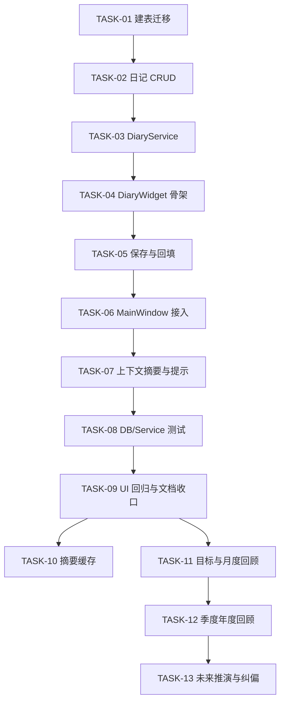

# 日记功能：人生轨迹分析与纠偏助手 — 开发任务清单（依赖排序 · 可断点续传）

> 创建时间: 2026-07-03  
> 基于: [2026-07-03-diary-life-companion.md](2026-07-03-diary-life-companion.md), [2026-07-03-diary-life-companion-user-stories.md](2026-07-03-diary-life-companion-user-stories.md)  
> 当前范围: 仅 Phase 1 进入开发范围；Phase 2 / Phase 3 保留设计预埋与后续 backlog  
> 总预估: 2.5 ~ 4 天（首批 9 个 TASK + 2 个检查点）  
> Commit 约定: 每个 TASK 完成后单独提交，commit 标题以 `TASK-NN` 结尾

---

## 范围说明

根据已确认顺序，当前执行策略如下：

- Phase 1：进入实际开发拆分
- `US-09` 目标系统：后移到 Phase 2，不进入首版开发
- `US-06` 当日日记摘要：首版不做，只保留数据模型兼容位
- `US-12` 三种未来推演：以至少 6-12 个月数据为前提，仅保留后续任务预埋

因此，当前 TASK 重点覆盖：

- `US-01` 在主窗口进入日记页面
- `US-02` 保存和编辑当日日记
- `US-03` 记录每日状态
- `US-04` 查看当日上下文摘要
- `US-05` 通过提示降低写作门槛

---

## 技术评审结论（已吸收）

本清单已根据技术评审吸收以下约束，后续开发必须遵守：

- 日记日期主键统一使用 `YYYY-MM-DD` ISO 字符串，不接受其他格式写入。
- Phase 1 的提示问题必须是纯本地规则生成，禁止在 `MainWindow.refresh()` 或 `DiaryWidget.refresh()` 链路中触发 AI 请求。
- `DiaryService` 只允许依赖 `Database` 暴露的查询接口，不允许直接依赖 Timer/Reminder 引擎内部状态。
- 日记页在切换日期时必须处理未保存内容，至少实现 dirty-check 提示或明确的自动保存策略。
- 每个 TASK 完成后都必须有对应的最小验证，不允许把测试全部堆到最后一次性补齐。

---

## 第一层：零依赖基础设施（L1 / L2）

### TASK-01: `database.py` — 新增 `diary_entries` 表与 migration
- **状态**: ✅ 已完成
- **依赖**: 无
- **文件**: `src/core/database.py`, `tests/test_database.py`
- **操作**:
  1. 在 `_init_db()` 中新增 `diary_entries` 建表语句与日期索引
  2. 保留 `ai_summary` 字段但首版不使用，避免后续再做破坏性迁移
  3. 确认字段覆盖 `content / mood_score / mood_emoji / energy_score / stress_score / tags / word_count / created_at / updated_at`
  4. 明确 `entry_date` 的唯一合法格式为 `YYYY-MM-DD`
- **验证**:
  - 新库初始化后存在 `diary_entries` 表
  - 重复初始化不报错
  - 旧库升级时 migration 安全
  - 新增或更新测试覆盖日期格式不变式
- **预计**: 30 分钟

### TASK-02: `database.py` — 实现日记 CRUD 基础接口
- **状态**: ✅ 已完成
- **依赖**: TASK-01
- **文件**: `src/core/database.py`, `tests/test_database.py`
- **操作**:
  1. 新增 `get_diary_entry(date_str)`
  2. 新增 `upsert_diary_entry(...)`
  3. 新增 `get_diary_entries_by_date_range(start_date, end_date)`
  4. 统一 `tags` JSON 编解码与 `word_count` 自动计算
  5. 对 `date_str` 做格式约束，统一只接受 ISO 日期字符串
- **验证**:
  - 可按日期创建新日记
  - 同一日期再次保存时走更新而非重复插入
  - 空正文但有状态时允许保存
  - 范围查询返回正确日期顺序
  - 非 ISO 日期输入时有明确失败行为或调用侧约束
- **预计**: 45 分钟

### TASK-03: 新增 `DiaryService` — 聚合日记页上下文与提示逻辑
- **状态**: ✅ 已完成
- **依赖**: TASK-02
- **文件**: `src/services/diary_service.py`, `tests/test_diary_service.py`
- **操作**:
  1. 创建 `DiaryService`
  2. 实现 `get_daily_context(date_str)`，聚合番茄数、专注时长、待办完成数、已有日记信息
  3. 实现 `get_diary_prompt_hints(date_str)`，优先使用规则生成 1-3 条提示
  4. 不接 AI，不做摘要生成，仅保证首版低成本可用
  5. 仅通过 `Database` 查询方法取数，不直接依赖其他引擎内部状态
- **验证**:
  - 有番茄和待办数据时能返回正确摘要
  - 无数据时能返回默认占位摘要与默认提示
  - 同日期已有日记时能带回已有状态和字数信息
  - 提示生成链路不触发任何 AI 调用
- **预计**: 45 分钟

---

## 检查点 CP-1：基础数据能力就绪

| 检查点 | 完成条件 | commit 范围 |
|--------|---------|-------------|
| CP-1 日记基础数据就绪 | TASK-01 ~ TASK-03 完成 | `TASK-01` ~ `TASK-03` |

**检查项**：
- [x] 数据库初始化 / 升级安全
- [x] 日记 CRUD 可单独工作
- [x] DiaryService 可独立输出日记页所需上下文
- [x] 以上 3 个 TASK 各自已有最小测试或验证，不留到末尾统一补

---

## 第二层：L3 UI 组件与主界面接入

### TASK-04: 新增 `DiaryWidget` 基础 UI 骨架
- **状态**: ✅ 已完成
- **依赖**: TASK-03
- **文件**: `src/ui/diary_widget.py`, `tests/test_diary_widget.py`
- **操作**:
  1. 创建 `DiaryWidget`
  2. 实现页面分区：日期标题、今日速览、提示区、状态区、正文区、保存按钮
  3. 保持现有 UI 风格，复用 `styles.py` 中已有样式能力
  4. 首版只提供纯文本 / Markdown 输入，不做富文本
- **验证**:
  - 页面能正常渲染所有区块
  - 无数据日期显示占位状态
  - 切换不同日期时组件可刷新
- **预计**: 60 分钟

### TASK-05: `DiaryWidget` — 接入保存与回填逻辑
- **状态**: ✅ 已完成
- **依赖**: TASK-04
- **文件**: `src/ui/diary_widget.py`, `tests/test_diary_widget.py`
- **操作**:
  1. 将保存按钮接到 `DiaryService` / `Database` 写入链路
  2. 支持正文 + 状态联合保存
  3. 支持已保存内容回填到 UI
  4. 首版不实现“保存并生成摘要”按钮，只保留未来扩展位置
  5. 为正文和状态控件增加 dirty-check 基础能力，准备处理日期切换时的未保存内容
- **验证**:
  - 输入正文后可保存
  - 只选状态不写正文也可保存
  - 再次打开同一日期能回填内容与状态
  - 二次保存走更新逻辑
  - 页面存在未保存修改时，日期切换前有明确处理行为
- **预计**: 45 分钟

### TASK-06: `main_window.py` — 新增“📓 日记”Tab 并接入刷新链路
- **状态**: ✅ 已完成
- **依赖**: TASK-05
- **文件**: `src/ui/main_window.py`, `tests/test_main_window.py`
- **操作**:
  1. 在 `_build_tabs()` 中新增 `DiaryWidget`
  2. 在 `refresh()` 中传入当前查看日期，驱动 `DiaryWidget.refresh(date_str)`
  3. 保证现有番茄 / 待办 / 提醒 / 统计 Tab 不受影响
  4. 明确日期切换时的未保存内容处理策略：提示保存、丢弃或自动保存三选一，首版需定一条
- **验证**:
  - 主窗口显示“📓 日记”Tab
  - 切换日期时日记页同步刷新
  - 其他 Tab 功能无回归
  - 未保存内容在日期切换时不会静默丢失
- **预计**: 30 分钟

### TASK-07: 日记页顶部上下文摘要与提示区联动
- **状态**: ✅ 已完成
- **依赖**: TASK-06
- **文件**: `src/ui/diary_widget.py`, `src/services/diary_service.py`, `tests/test_diary_widget.py`, `tests/test_diary_service.py`
- **操作**:
  1. 将 `get_daily_context()` 的数据绑定到“今日速览”区域
  2. 将 `get_diary_prompt_hints()` 的结果绑定到提示区
  3. 定义无工作数据时的占位文案
  4. 保证该绑定逻辑仅使用本地同步数据，不引入阻塞性重计算
- **验证**:
  - 有番茄/待办时显示正确摘要
  - 无数据时显示默认文案
  - 切换日期后提示与摘要同步变化
  - 页面刷新不会触发额外线程或 AI 请求
- **预计**: 45 分钟

---

## 检查点 CP-2：Phase 1 核心交互就绪

| 检查点 | 完成条件 | commit 范围 |
|--------|---------|-------------|
| CP-2 日记主流程就绪 | TASK-04 ~ TASK-07 完成 | `TASK-04` ~ `TASK-07` |

**检查项**：
- [x] 用户能在主窗口进入日记 Tab
- [x] 用户能保存 / 编辑某日期日记
- [x] 状态记录正常
- [x] 顶部摘要和提示区可用
- [x] 日期切换时未保存内容不会静默丢失

---

## 第三层：测试补齐与首版收口

### TASK-08: 补齐数据库与服务层测试
- **状态**: ✅ 已完成
- **依赖**: TASK-07
- **文件**: `tests/test_database.py`, `tests/test_diary_service.py`
- **操作**:
  1. 完整覆盖 diary 表初始化、upsert、范围查询
  2. 覆盖上下文摘要、默认提示、日期切换数据装配
  3. 处理空数据和轻量记录边界条件
  4. 覆盖 ISO 日期格式约束与本地规则提示不走 AI 的约束
- **验证**:
  - 相关单测全部通过
  - 边界条件无异常
- **预计**: 45 分钟

### TASK-09: 补齐 UI 回归测试并更新文档索引
- **状态**: ✅ 已完成
- **依赖**: TASK-08
- **文件**: `tests/test_diary_widget.py`, `tests/test_main_window.py`, `README.md`（如需）, `docs/evolution-roadmap.md`（如需后续登记）
- **操作**:
  1. 补齐 `DiaryWidget` 的保存、刷新、占位态测试
  2. 补齐 `MainWindow` 新 Tab 的集成测试
  3. 补齐日期切换时 dirty-check / 自动保存策略测试
  4. 如项目约定需要，更新 README 模块说明或路线图状态说明
- **验证**:
  - 新增 UI 测试通过
  - 既有主窗口相关测试无回归
  - 文档与实现范围保持一致
- **预计**: 45 分钟

---

## 检查点 CP-3：Phase 1 可交付

| 检查点 | 完成条件 | commit 范围 |
|--------|---------|-------------|
| CP-3 首版日记功能可交付 | TASK-08 ~ TASK-09 完成 | `TASK-08` ~ `TASK-09` |

**检查项**：
- [x] 日记 Tab 完整可用
- [x] 基础数据链路与 UI 链路都有测试覆盖
- [x] 首版范围严格控制在 Phase 1
- [x] 未提前实现摘要、目标系统、未来推演

---

## 后续 Backlog（不进入首版开发）

### TASK-10: 新增 `ai_insights` 与当日日记摘要缓存能力
- **状态**: ⬜ 未开始
- **依赖**: CP-3
- **文件**: `src/core/database.py`, `src/services/ai_client.py`, `src/services/diary_service.py`, `src/ui/diary_widget.py`
- **操作**: 为 `US-06` 补上摘要生成与缓存逻辑
- **验证**: 摘要生成失败不影响原文；相同输入可复用缓存
- **预计**: 60 分钟

### TASK-11: 目标系统与月度回顾基础能力
- **状态**: ⬜ 未开始
- **依赖**: CP-3
- **文件**: `src/core/database.py`, `src/services/diary_service.py`, `src/ui/insight_window.py`, `tests/...`
- **操作**: 实现 `US-07` 与 `US-09` 的最小闭环
- **验证**: 可创建目标并生成月度回顾
- **预计**: 1 ~ 1.5 天

### TASK-12: 季度 / 年度回顾与偏离检测
- **状态**: ⬜ 未开始
- **依赖**: TASK-11
- **文件**: `src/services/diary_service.py`, `src/ui/insight_window.py`, `src/services/ai_client.py`, `tests/...`
- **操作**: 实现 `US-08` / `US-10` / `US-11`
- **验证**: 季度与年度分析可生成且有数据充分度提示
- **预计**: 1.5 ~ 2 天

### TASK-13: 三种未来推演与纠偏建议闭环
- **状态**: ⬜ 未开始
- **依赖**: TASK-12
- **文件**: `src/services/diary_service.py`, `src/services/ai_client.py`, `src/ui/insight_window.py`, `tests/...`
- **操作**: 实现 `US-12` / `US-13` / `US-14`
- **验证**: 数据门槛生效；三种未来场景与建议均可追溯依据
- **预计**: 2 ~ 3 天

---

## 依赖图（简版）

---

## 结论

这份 TASK 清单将已确认的顺序转化为可开发执行的依赖链，并明确限制首版范围只落在 Phase 1。后续如果进入开发，可以直接从 `TASK-01` 开始顺序推进；如果要继续保留门禁流程，则当前应等待你确认这份任务拆分。 
