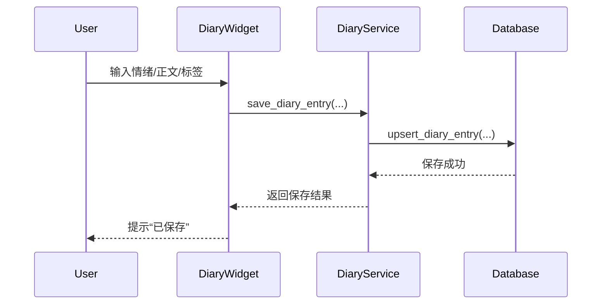
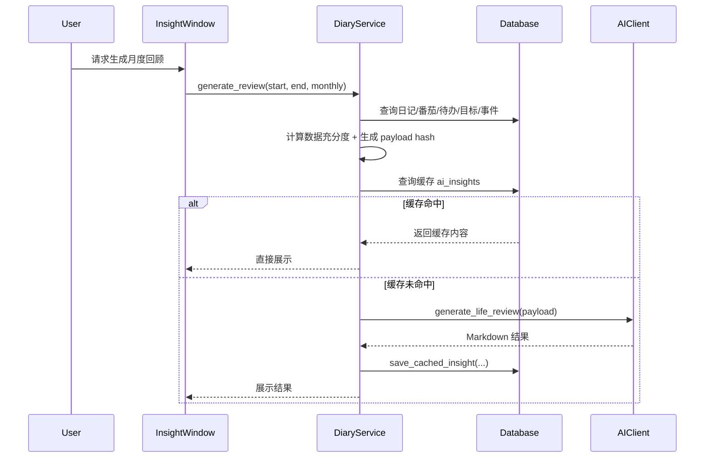

# 日记功能：人生轨迹分析与纠偏助手（正式设计方案）

> 创建时间: 2026-07-03  
> 状态: 方案设计 / 待确认  
> 基于: 用户头脑风暴 + 当前 POMATO 产品能力 + 现有四层架构  
> 优先级: 战略级方向（建议拆分为多阶段落地）

---

## 目录

- [1. 背景与目标](#1-背景与目标)
- [2. 产品定位与价值主张](#2-产品定位与价值主张)
- [3. 功能范围与非目标](#3-功能范围与非目标)
- [4. 用户故事与验收标准](#4-用户故事与验收标准)
- [5. 信息架构与页面交互](#5-信息架构与页面交互)
- [6. 数据模型设计](#6-数据模型设计)
- [7. 技术方案](#7-技术方案)
- [8. AI 分析与未来推演方案](#8-ai-分析与未来推演方案)
- [9. 与现有系统的集成](#9-与现有系统的集成)
- [10. 实施路线图](#10-实施路线图)
- [11. 测试策略](#11-测试策略)
- [12. 风险与缓解](#12-风险与缓解)
- [13. 待确认问题](#13-待确认问题)

---

## 1. 背景与目标

### 1.1 背景

当前 POMATO 已支持：

- 番茄钟计时
- 弹窗碎片记录
- 待办与提醒
- AI 日报 / 周报 / 月报
- 历史报告查阅

现有能力能较好回答“今天做了什么”“本周产出了什么”，但仍缺少对长期问题的支持：

- 我这一年整体处于什么状态
- 我最近半年是在成长、停滞还是偏航
- 我的时间投入和情绪变化，会把我带向什么未来
- 如果我正在偏离目标，系统能否尽早提醒并给出可执行建议

因此，本功能不是简单新增一个日记输入框，而是要构建一个长期个人轨迹系统，使 POMATO 从“效率工具”升级为“长期陪伴式个人助手”。

### 1.2 总体目标

本项目希望在长期使用条件下，逐步实现四层能力：

1. 长期记录：沉淀用户的主观反思与状态信息。
2. 长期回顾：按月、季度、年度帮助用户理解自己的变化。
3. 趋势推演：基于长期行为与文本数据推演未来趋势。
4. 纠偏建议：识别偏离并输出可执行的改善建议。

### 1.3 一句话价值主张

> 让 POMATO 不只是记录你的今天，而是理解你的过去、解释你的现在，并帮助你看见和修正未来。

---

## 2. 产品定位与价值主张

### 2.1 定位升级

| 当前定位 | 目标定位 |
|----------|----------|
| 番茄钟 + AI 日报工具 | 长期生活 / 工作轨迹分析与纠偏助手 |
| 记录今日工作 | 观察多年变化 |
| 单日 / 单周总结 | 长周期趋势分析 |
| 结果输出 | 持续陪伴与建议 |

### 2.2 目标用户

核心面向：

- 持续使用 POMATO 进行工作记录的知识工作者
- 有长期复盘需求的开发者、产品、设计、研究人员
- 对职业发展、效率、情绪状态有自我观察需求的用户
- 希望通过 AI 获得持续反馈与行动建议的用户

### 2.3 用户价值

用户将获得：

1. 对自身长期状态的可见性，而不是依赖模糊记忆。
2. 客观行为数据与主观反思的结合视图。
3. 对目标偏航、精力透支、学习停滞等风险的提前预警。
4. 带证据链的 AI 建议，而不是空泛总结。
5. 随使用时间增长而增强的陪伴感和数据壁垒。

---

## 3. 功能范围与非目标

### 3.1 功能范围

本设计首阶段覆盖以下能力：

- 日记记录、编辑、按日期查看
- 每日情绪 / 状态标记
- 日记与番茄 / 待办 / 报告的联动展示
- 月度 / 季度 / 年度回顾
- 目标记录与偏离检测
- 三种未来推演的设计预埋
- 纠偏建议的设计预埋

### 3.2 非目标

以下内容不作为首阶段目标：

- 医疗 / 心理诊疗建议
- 社交化日记功能
- 图片 / 音频 / 视频为核心的富媒体日记
- 对未来作确定性结论
- 团队共享式个人分析

---

## 4. 用户故事与验收标准

### US-01: 记录日记与个人状态
> 优先级: P0

**作为** 持续复盘自己的用户，  
**我希望** 在每天工作结束前快速写下日记并记录当天状态，  
**以便** 为后续的长期分析和回顾提供真实素材。

**验收标准**：
- [ ] Given 用户打开日记页面, When 输入文本并点击保存, Then 当日日记被成功持久化
- [ ] Given 某日已有日记, When 再次打开该日期, Then 可看到并编辑原内容
- [ ] Given 用户只输入一句话或只标记情绪, When 保存, Then 系统允许保存且不强制长文本
- [ ] Given 用户切换日期, When 打开对应日记, Then 页面显示该日期的关联摘要与日记内容

### US-02: 借助提示降低写作门槛
> 优先级: P0

**作为** 不擅长每天主动写日记的用户，  
**我希望** 系统根据我当天的记录和历史上下文给出写作提示，  
**以便** 我更容易开始记录。

**验收标准**：
- [ ] Given 用户打开某日日记页, When 页面加载, Then 页面顶部展示 1-3 条 AI 或规则生成的提示问题
- [ ] Given 当天已有番茄记录或待办数据, When 展示提示, Then 提示与当日工作上下文相关
- [ ] Given 数据不足, When 页面加载, Then 回退到固定模板提示而不是空白页面

### US-03: 查看月度 / 季度 / 年度回顾
> 优先级: P0

**作为** 长期使用产品的用户，  
**我希望** AI 能按月、季度、年度帮我总结阶段变化，  
**以便** 我理解自己过去一段时间的轨迹。

**验收标准**：
- [ ] Given 已有一个月以上数据, When 生成月度回顾, Then 输出本月主要主题、状态趋势和行为摘要
- [ ] Given 已有一个季度以上数据, When 生成季度回顾, Then 输出重点变化、目标推进与风险信号
- [ ] Given 已有一年数据, When 生成年度回顾, Then 输出年度变化、长期趋势与关键转折点
- [ ] Given 某周期数据不足, When 请求生成, Then 明确提示数据充分度与结果局限

### US-04: 追踪目标并识别偏航
> 优先级: P0

**作为** 给自己设定成长目标的用户，  
**我希望** 系统能检查我的实际行为是否持续偏离目标，  
**以便** 我在偏差变大前及时调整。

**验收标准**：
- [ ] Given 用户已设置年度或季度目标, When 系统分析近期数据, Then 能判断目标推进、停滞或偏离状态
- [ ] Given 检测到明显偏离, When 展示分析结果, Then 至少包含偏离证据、可能原因和下一步建议
- [ ] Given 用户查看偏离原因, When 展示依据, Then 可以看到关联的日记主题、行为趋势或完成率变化

### US-05: 获得三种未来推演
> 优先级: P1

**作为** 关注长期成长和职业发展方向的用户，  
**我希望** AI 基于我的长期数据输出最可能、最积极、最消极三种未来场景，  
**以便** 我更早理解当前路径的长期影响。

**验收标准**：
- [ ] Given 用户具备长期历史数据, When 打开未来分析页, Then 系统展示三种未来场景卡片
- [ ] Given 用户查看任一未来场景, When 展开详情, Then 页面展示形成条件、关键证据与风险/机会说明
- [ ] Given 数据不足以支撑未来推演, When 用户请求分析, Then 系统提示尚未达到建议分析门槛

### US-06: 感受到连续的理解与陪伴
> 优先级: P1

**作为** 长期用户，  
**我希望** 产品的分析和反馈能引用我的历史上下文，  
**以便** 我感受到这是一个持续理解我的系统而非一次性工具。

**验收标准**：
- [ ] Given 用户长期使用, When 生成回顾或建议, Then 文本中能引用历史主题、目标或关键事件
- [ ] Given 用户经历阶段性变化, When AI 反馈, Then 能体现前后状态差异和趋势解释

---

## 5. 信息架构与页面交互

### 5.1 信息架构

建议新增一个“日记”主入口，并在后续扩展独立的分析页：

```
MainWindow
├── 🍅 番茄
├── 📋 待办
├── ⏰ 提醒
├── 📊 统计
└── 📓 日记         ← 新增（Phase 1）

Report / Analysis Surface
├── 📋 日报
├── 📋 周报
├── 📋 月报
├── 📘 月度回顾      ← Phase 2
├── 📘 季度回顾      ← Phase 2
├── 📘 年度回顾      ← Phase 2
└── 🔮 未来推演      ← Phase 3
```

### 5.2 MainWindow：新增“📓 日记”Tab

保持现有主窗口结构不变，仅新增一个 Tab，避免打破既有使用习惯。

#### 日记 Tab 布局

```
┌─────────────────────────────────────────────────────────┐
│ 📓 日记  2026-07-03 · 今日                              │
├─────────────────────────────────────────────────────────┤
│ 今日速览                                                │
│ 🍅 6 个番茄  ⏱ 150 分钟  ✅ 待办 4/6  😊 情绪：平稳       │
├─────────────────────────────────────────────────────────┤
│ AI 写作提示                                             │
│ - 今天哪件事最耗费你的精力？                            │
│ - 你今天最满意的一次投入是什么？                        │
│ - 有什么事重复出现，值得引起注意？                      │
├─────────────────────────────────────────────────────────┤
│ 今日状态                                                │
│ 情绪: 😞 😐 🙂 😊 😄                                     │
│ 精力: 1 2 3 4 5                                          │
│ 压力: 1 2 3 4 5                                          │
├─────────────────────────────────────────────────────────┤
│ 日记内容                                                │
│ ┌─────────────────────────────────────────────────────┐ │
│ │                                                     │ │
│ │  Markdown / 纯文本输入区                             │ │
│ │                                                     │ │
│ └─────────────────────────────────────────────────────┘ │
├─────────────────────────────────────────────────────────┤
│ 标签: #成长 #疲惫 #学习 #工作推进                        │
│ [保存] [保存并生成摘要] [查看本月回顾]                   │
└─────────────────────────────────────────────────────────┘
```

#### 页面交互

1. 用户切换到“📓 日记”Tab。
2. 默认打开当前日期，可用顶部日期选择器切换历史日期。
3. 顶部速览展示当天已存在的番茄 / 待办摘要。
4. 页面显示系统生成的写作提示。
5. 用户填写状态与日记内容。
6. 点击保存后，仅持久化日记，不阻塞主界面。
7. 点击“保存并生成摘要”时，异步生成当日日记摘要或关键词。

#### 交互原则

- 默认是低门槛写作，不强制结构化。
- 允许用户只写一句话。
- 状态标记通过轻量点击完成，不增加输入负担。
- 顶部速览帮助用户从“今天做了什么”快速过渡到“我怎么看待今天”。

### 5.3 日记详情 / 历史查看

首阶段不单独做复杂历史日记窗口，先复用主窗口日期切换能力；后续可增设“日记历史”对话框。

建议行为：

- 主窗口左上日期切换时，“📓 日记”Tab 同步切换到对应日期。
- 当日无日记时显示占位文案与提示问题。
- 当日已有日记时显示上次保存时间与字数。

### 5.4 回顾窗口设计

建议复用当前 `ReportWindow` 的交互形态，但新增一种“回顾”类型，或新建 `InsightWindow`，避免把“日报导出”与“长期洞察”混在同一个窗口语义里。

#### InsightWindow 布局建议

```
┌──────────────────────────────────────────────────────────┐
│ 📘 月度回顾   周期: [月度 ▾]   范围: 2026/07/01~07/31    │
├──────────────────────────────────────────────────────────┤
│ 数据充分度: 良好  (日记 22 天 / 番茄记录 19 天)          │
├──────────────────────────────────────────────────────────┤
│ 左侧导航                      │ 右侧分析内容              │
│ - 总览                        │ ## 本月关键词             │
│ - 情绪趋势                    │ ## 状态变化               │
│ - 目标推进                    │ ## 工作投入分布           │
│ - 风险信号                    │ ## 建议行动               │
├──────────────────────────────────────────────────────────┤
│ [重新生成] [复制] [导出 Markdown] [关闭]                │
└──────────────────────────────────────────────────────────┘
```

#### 回顾页的关键模块

- 总览摘要
- 情绪/精力趋势
- 番茄与待办投入结构摘要
- 高频主题 / 关键词
- 目标推进 / 偏离
- 风险信号
- 建议行动

### 5.5 未来推演页设计

Phase 3 再开放，不建议在首阶段暴露。界面建议如下：

```
┌─────────────────────────────────────────────────────────┐
│ 🔮 未来推演 · 基于过去 12 个月数据                        │
├─────────────────────────────────────────────────────────┤
│ [📊 最可能]   [📈 最积极]   [📉 最消极]                   │
├─────────────────────────────────────────────────────────┤
│ 标题：如果维持当前惯性，你在 1~3 年后最可能的状态          │
│                                                         │
│ - 工作形态                                              │
│ - 技能结构                                              │
│ - 风险与瓶颈                                            │
│ - 形成依据                                              │
│ - 建议调整                                              │
├─────────────────────────────────────────────────────────┤
│ 形成依据：                                              │
│ - 最近 6 个月“学习”标签显著减少                          │
│ - 日记中“疲惫/没时间”主题频繁出现                        │
│ - 高优先级待办结转率上升                                │
└─────────────────────────────────────────────────────────┘
```

---

## 6. 数据模型设计

### 6.1 设计原则

- 仍基于 SQLite，本地优先。
- 结构化字段只保留高价值、低负担的元信息。
- 长文本与 AI 洞察分层存储，避免重复计算。
- 预留目标、关键事件、AI 摘要缓存表，以支持长期分析。

### 6.2 新增表：`diary_entries`

```sql
CREATE TABLE IF NOT EXISTS diary_entries (
    id              INTEGER PRIMARY KEY AUTOINCREMENT,
    entry_date      TEXT NOT NULL UNIQUE,
    content         TEXT NOT NULL DEFAULT '',
    mood_score      INTEGER,
    mood_emoji      TEXT,
    energy_score    INTEGER,
    stress_score    INTEGER,
    tags            TEXT NOT NULL DEFAULT '[]',
    word_count      INTEGER NOT NULL DEFAULT 0,
    ai_summary      TEXT,
    created_at      TEXT NOT NULL,
    updated_at      TEXT NOT NULL
);

CREATE INDEX IF NOT EXISTS idx_diary_entries_date ON diary_entries(entry_date);
```

#### 字段说明

| 字段 | 类型 | 说明 |
|------|------|------|
| `entry_date` | TEXT | 日期主键语义，一天一篇 |
| `content` | TEXT | 日记正文 |
| `mood_score` | INTEGER | 情绪评分，建议 1-5 |
| `mood_emoji` | TEXT | 直观展示使用 |
| `energy_score` | INTEGER | 精力评分 |
| `stress_score` | INTEGER | 压力评分 |
| `tags` | TEXT(JSON) | 自定义日记标签 |
| `word_count` | INTEGER | 便于分析书写密度 |
| `ai_summary` | TEXT | 当日日记摘要缓存 |

### 6.3 新增表：`life_goals`

```sql
CREATE TABLE IF NOT EXISTS life_goals (
    id              INTEGER PRIMARY KEY AUTOINCREMENT,
    period_type     TEXT NOT NULL,
    period_key      TEXT NOT NULL,
    category        TEXT NOT NULL,
    title           TEXT NOT NULL,
    description     TEXT NOT NULL DEFAULT '',
    target_metric   TEXT NOT NULL DEFAULT '',
    target_value    TEXT NOT NULL DEFAULT '',
    status          TEXT NOT NULL DEFAULT 'active',
    created_at      TEXT NOT NULL,
    updated_at      TEXT NOT NULL
);

CREATE INDEX IF NOT EXISTS idx_life_goals_period ON life_goals(period_type, period_key);
```

#### 用途

- 为偏离检测提供目标基准。
- 支撑季度/年度回顾中的目标推进模块。
- 后续可扩展目标完成率与证据链接。

### 6.4 新增表：`life_events`

```sql
CREATE TABLE IF NOT EXISTS life_events (
    id              INTEGER PRIMARY KEY AUTOINCREMENT,
    event_date      TEXT NOT NULL,
    event_type      TEXT NOT NULL,
    title           TEXT NOT NULL,
    note            TEXT NOT NULL DEFAULT '',
    created_at      TEXT NOT NULL
);

CREATE INDEX IF NOT EXISTS idx_life_events_date ON life_events(event_date);
```

#### 用途

- 标记转折点，帮助年度回顾和未来推演更准确地建立时间锚点。

### 6.5 新增表：`ai_insights`

```sql
CREATE TABLE IF NOT EXISTS ai_insights (
    id              INTEGER PRIMARY KEY AUTOINCREMENT,
    insight_type    TEXT NOT NULL,
    period_start    TEXT NOT NULL,
    period_end      TEXT NOT NULL,
    input_hash      TEXT NOT NULL,
    data_score      INTEGER NOT NULL DEFAULT 0,
    content         TEXT NOT NULL,
    model_name      TEXT NOT NULL DEFAULT '',
    created_at      TEXT NOT NULL,
    UNIQUE(insight_type, period_start, period_end, input_hash)
);

CREATE INDEX IF NOT EXISTS idx_ai_insights_period ON ai_insights(insight_type, period_start, period_end);
```

#### 用途

- 缓存分析结果，避免相同数据重复调用 AI。
- 记录分析所用模型，方便问题排查。
- `data_score` 表示本次分析的数据充分度。

### 6.6 推荐新增只读聚合方法

首阶段不急于引入物化统计表，优先在 `Database` 中新增查询方法：

- `get_diary_entry(date_str)`
- `save_diary_entry(...)`
- `list_diary_entries(start_date, end_date)`
- `get_goal_list(period_type=None, period_key=None)`
- `save_goal(...)`
- `get_life_events(start_date, end_date)`
- `get_diary_stats(start_date, end_date)`
- `get_behavior_snapshot(start_date, end_date)`
- `get_cached_insight(insight_type, start_date, end_date, input_hash)`
- `save_cached_insight(...)`

---

## 7. 技术方案

### 7.1 架构分层

遵循现有四层架构：

```
main.py
  → src/core/database.py            (L1 数据持久化)
  → src/services/diary_service.py   (L2 日记聚合与分析编排，新增)
  → src/services/ai_client.py       (L2 AI 调用扩展)
  → src/ui/diary_widget.py          (L3 日记主界面组件，新增)
  → src/ui/insight_window.py        (L3 长期回顾/未来推演窗口，新增)
  → src/app.py / src/ui/main_window.py (L4 编排与入口接线)
```

### 7.2 模块设计

#### L1：`Database` 扩展

职责：

- 维护新表的 migration
- 提供 diary / goals / insights 的 CRUD
- 提供按日期范围聚合的基础查询

建议新增方法：

```python
def get_diary_entry(self, date_str: str) -> dict | None: ...
def upsert_diary_entry(self, date_str: str, content: str,
                       mood_score: int | None = None,
                       mood_emoji: str | None = None,
                       energy_score: int | None = None,
                       stress_score: int | None = None,
                       tags: list[str] | None = None,
                       ai_summary: str | None = None): ...

def get_diary_entries_by_date_range(self, start_date: str, end_date: str) -> list[dict]: ...
def get_goal_list(self, period_type: str | None = None, period_key: str | None = None) -> list[dict]: ...
def upsert_goal(...): ...
def get_cached_insight(...): ...
def save_cached_insight(...): ...
```

#### L2：`DiaryService`（新增）

建议新增一个服务层，而不是让 UI 直接拼装所有数据，原因：

- 日记页需要同时读取 diary + pomodoro + todos + existing reports
- 长期回顾需要做数据充分度判断、输入压缩、缓存命中、分析编排
- 目标偏离与未来推演逻辑不适合塞入 UI

核心职责：

1. 组装日记页所需的“今日速览”数据。
2. 生成日记提示问题。
3. 生成分析输入快照。
4. 管理 insight 缓存与 AI 调用。
5. 判断数据充分度与回退策略。

建议接口：

```python
class DiaryService:
    def get_daily_context(self, date_str: str) -> dict: ...
    def get_diary_prompt_hints(self, date_str: str) -> list[str]: ...
    def save_diary_entry(self, ...): ...
    def build_review_payload(self, start_date: str, end_date: str, period: str) -> dict: ...
    def generate_review(self, start_date: str, end_date: str, period: str) -> str: ...
    def detect_goal_drift(self, start_date: str, end_date: str) -> list[dict]: ...
```

#### L2：`AIClient` 扩展

当前 `AIClient.generate_report()` 已承接日报 / 周报 / 月报。

新增建议：

- `generate_diary_summary(diary_entry, daily_context)`
- `generate_life_review(review_payload, period)`
- `generate_future_projection(projection_payload, horizon='1y'|'3y')`

不建议把所有场景都继续塞进 `generate_report()`，否则语义过载。应将“工作报告”和“人生回顾”拆为不同 prompt builder。

#### L3：`DiaryWidget`（新增）

职责：

- 主窗口“📓 日记”Tab 内容组件
- 展示当天上下文、提示问题、状态控件、正文输入区
- 保存日记并触发轻量摘要

#### L3：`InsightWindow`（新增）

职责：

- 展示月度 / 季度 / 年度回顾
- 展示目标偏离和风险提示
- 后续展示未来推演

### 7.3 数据流

#### 写日记流程



#### 生成回顾流程



### 7.4 数据充分度策略

为避免低质量输出，需要在服务层定义最小门槛：

| 场景 | 建议门槛 |
|------|----------|
| 日记当日摘要 | 有正文或状态即可 |
| 月度回顾 | 当月至少 8 天日记，或 12 天行为数据 |
| 季度回顾 | 至少 30 天有效行为数据 + 15 天日记 |
| 年度回顾 | 至少 4 个月有效行为数据 + 40 天日记 |
| 未来推演 | 至少 6-12 个月数据，且需目标 / 状态 / 行为多源数据 |

当数据不足时：

- 不拒绝展示页面
- 但要降级为“阶段观察”而非“趋势判断”
- 在 UI 中明确提示“结果局限”

### 7.5 缓存与重新生成策略

- 回顾类分析默认先查缓存。
- 当输入数据 hash 未变化时直接复用。
- 用户点击“重新生成”时可跳过缓存强制刷新。
- 对未来推演建议设置更长缓存周期，避免频繁生成导致表达波动。

### 7.6 并发与线程模型

保持与现有项目一致：

- 日记保存走主线程同步 DB 写入即可。
- AI 分析使用与 `ReportWindow` 类似的 `QThread` worker。
- 不引入新后台线程常驻服务。

---

## 8. AI 分析与未来推演方案

### 8.1 为什么不能直接用原始数据喂模型

长期数据量大，且质量不均匀，直接把 1 年日记与全部行为记录塞进 prompt 会带来：

- Token 过长
- 噪声多
- 输出不稳定
- 本地模型表现更差

因此需要分层压缩。

### 8.2 分层摘要方案

```
原始层
├── 每日日记
├── 每日番茄记录
├── 每日待办完成情况
└── 每日情绪/状态

压缩层
├── 当日日记摘要
├── 周度行为摘要
├── 月度回顾摘要
└── 目标推进摘要

分析层
├── 季度 / 年度回顾
├── 风险信号检测
└── 三种未来推演
```

首阶段建议：

- 只做“当日日记摘要”和“月度回顾缓存”
- 季度/年度分析复用月度摘要而不是全量原文

### 8.3 Prompt 设计拆分

建议至少分为 4 类 prompt：

1. `diary_coach_prompt`
   - 生成当日写作提示问题
2. `diary_summary_prompt`
   - 生成单篇日记摘要 / 关键词
3. `life_review_prompt`
   - 生成月度 / 季度 / 年度回顾
4. `future_projection_prompt`
   - 生成三种未来场景与建议

### 8.4 三种未来推演方法约束

#### 最可能未来

- 基于当前惯性趋势外推
- 输入重点：投入结构、情绪趋势、目标推进情况、学习主题变化

#### 最积极未来

- 假设用户改善关键短板并持续放大优势
- 需要明确列出“成立前提”

#### 最消极未来

- 假设当前风险不被处理并持续累积
- 需要明确列出“风险触发条件”

#### 输出约束

每一种未来必须包含：

- 场景描述
- 形成路径
- 关键依据
- 风险/机会
- 建议行动

### 8.5 纠偏建议生成原则

纠偏建议不是鸡汤，需要满足：

1. 建议必须能映射到证据。
2. 建议必须是可执行动作，而不是抽象态度。
3. 优先输出“最小下一步”。
4. 建议应尽量与现有产品能力衔接，如提醒、待办、番茄计划。

示例：

- 不推荐：“你需要更努力地学习。”
- 推荐：“过去 8 周你仅有 3 条学习相关记录，建议本周五固定留出 1 个番茄钟用于学习，并为下周一创建提醒。”

---

## 9. 与现有系统的集成

### 9.1 与 MainWindow 集成

现有 `MainWindow._build_tabs()` 已包含：

- 🍅 番茄
- 📋 待办
- ⏰ 提醒
- 📊 统计

建议新增：

- 📓 日记

集成方式：

- 新建 `DiaryWidget(self.db, self.config, diary_service)`
- 在 `MainWindow._build_tabs()` 中 `addTab`
- 在 `refresh()` 中，如果当前日期变化，通知 `DiaryWidget.refresh(date_str)`

### 9.2 与 ReportWindow 的关系

当前 `ReportWindow` 是工作报告窗口，语义上偏导出与编辑。

建议：

- 保留 `ReportWindow` 继续服务日报 / 周报 / 月报
- 新增 `InsightWindow` 专门负责月度 / 季度 / 年度回顾与未来推演
- 避免一个窗口同时承担“导出工作报告”和“长期人生洞察”，导致交互语义混乱

### 9.3 与 TrayManager 集成

可新增菜单项，但不是首阶段必需。建议顺序：

Phase 1：

- 不在托盘菜单直接增加日记入口
- 主入口仍从主窗口 Tab 进入

Phase 2：

- 增加“📘 月度回顾”菜单项
- 增加“🔮 未来推演”菜单项（当满足数据门槛时显示）

### 9.4 与现有报告链路集成

日记与报告应保持松耦合：

- 工作日报仍以番茄 / 待办为核心
- 日记不强制注入日报
- 但月度 / 季度 / 年度回顾会融合日报摘要作为辅助证据

### 9.5 与现有提醒 / 待办联动

纠偏建议可落到现有模块：

- 生成建议待办
- 创建定期提醒
- 在某些目标上生成番茄计划建议

这使“洞察 → 行动”形成产品闭环。

---

## 10. 实施路线图

### Phase 1：日记基础设施（建议 v2.5）

目标：建立稳定的数据采集与低门槛记录体验。

范围：

- `diary_entries` 表
- `DiaryWidget`
- 日记 CRUD
- 情绪/精力/压力标记
- 今日速览
- 写作提示（优先规则驱动）
- 当日日记摘要（可选）

### Phase 2：长期回顾与目标系统（建议 v3.0）

目标：让用户从“有记录”升级为“有阶段洞察”。

范围：

- `life_goals` / `life_events` / `ai_insights`
- `InsightWindow`
- 月度 / 季度 / 年度回顾
- 目标设定与偏离检测
- 风险信号识别

### Phase 3：未来推演与纠偏体系（建议 v3.5）

目标：形成差异化最强的长期价值能力。

范围：

- 三种未来推演
- 数据充分度分级
- 风险预警
- 行动建议联动到待办/提醒
- 对话式追问（后续可选）

---

## 11. 测试策略

### 11.1 数据层测试

新增测试：

- `diary_entries` migration
- `upsert_diary_entry()` 正常路径 / 更新路径 / 空内容路径
- `get_diary_entries_by_date_range()`
- `goal` CRUD
- `ai_insights` 缓存命中与覆盖逻辑

### 11.2 服务层测试

新增测试：

- `get_daily_context()` 聚合正确性
- 数据充分度判断
- prompt hint 回退逻辑
- review payload 构造
- 缓存命中时不重复调用 AI

### 11.3 UI 测试

新增测试：

- `DiaryWidget` 加载当日数据
- 保存日记
- 切换日期刷新内容
- 状态控件交互
- `InsightWindow` 周期选择、生成流程、数据不足提示

### 11.4 AI 相关测试

新增测试：

- diary summary prompt builder
- life review prompt builder
- future projection prompt builder
- 数据不足时的降级提示词构建

### 11.5 回归要求

必须确认：

- 现有番茄 / 待办 / 提醒 / 日报链路无回归
- 新增 Tab 不影响主窗口刷新性能
- 数据库 migration 对旧用户安全

---

## 12. 风险与缓解

### 风险 1：用户长期坚持率不足

影响：长期分析失去数据基础。

缓解：

- 一句话也能保存
- 用提示问题降低空白页压力
- 先提供月度回顾，让用户在 30 天内看到回报

### 风险 2：AI 推演像“算命”

影响：用户失去信任。

缓解：

- 每个结论都要展示依据
- 未来推演只作为趋势场景
- 明确数据充分度与置信边界

### 风险 3：长期数据过长导致分析质量下降

影响：输出空泛、成本高。

缓解：

- 分层摘要
- insight 缓存
- 限制输入窗口，优先喂摘要而非原文

### 风险 4：隐私敏感度大幅提升

影响：用户对 AI 分析有顾虑。

缓解：

- 本地存储优先
- 后续可考虑对日记单独加密
- 明确说明哪些数据会进入 AI

### 风险 5：功能膨胀侵蚀主流程

影响：主窗口变复杂，新用户压迫感强。

缓解：

- 采用新增 Tab 的渐进式入口
- 未来推演不在首阶段暴露
- 回顾窗口与工作报告窗口分离

---

## 13. 待确认问题

以下问题建议在用户确认阶段明确：

1. 日记首阶段是否只支持纯文本 / Markdown，不支持富文本。——是
2. 情绪维度是否只保留 `mood / energy / stress` 三项，避免输入负担过重。——是
3. 目标系统是否首阶段就做，还是放到 Phase 2。——Phase 2
4. 月度回顾是否允许直接引用周报 / 月报已有摘要，减少 token 消耗。——是
5. 未来推演的默认时间跨度，是 1 年、3 年还是两者都支持。——两者都支持
6. 是否在隐私层面把“日记参与 AI 分析”设计成用户显式开关。——是

---

## 14. 结论

本方案将“日记功能”正式定义为一个长期个人轨迹与纠偏系统，而不是独立的文本记录点。其落地策略必须遵循：

1. 先建立持续记录能力。
2. 再建立阶段回顾与目标偏离识别。
3. 最后进入未来推演与建议闭环。

如果执行得当，这将成为 POMATO 从效率工具升级为长期陪伴型个人成长产品的关键转折点。
