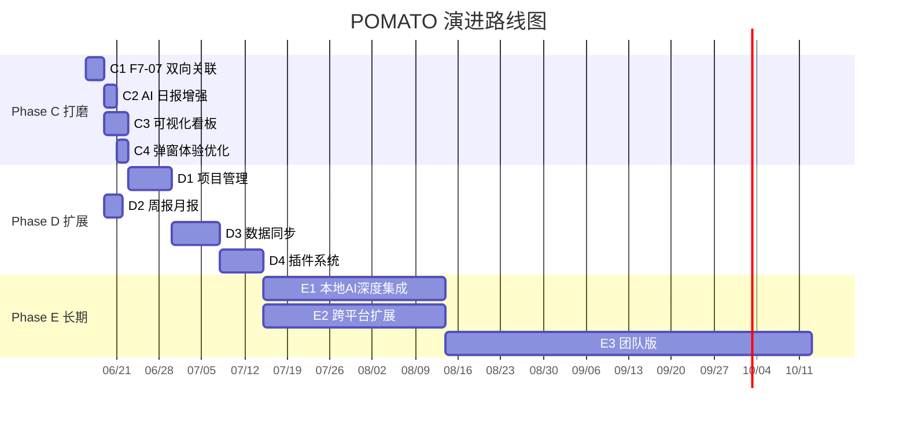

# POMATO 项目演进方案 (Evolution Roadmap)

> **版本**: v1.0  
> **日期**: 2026-06-12  
> **基于**: 当前代码库分析 + 项目规格 (project-spec.md) + 设计文档 (design/2026-06-11-todo-reminder.md)  
> **当前版本**: v2.0（Phase A+B 完成，含待办+提醒）

---

## 目录

- [0. 当前状态审计](#0-当前状态审计)
- [1. Phase C：短期打磨 (v2.1 ~ v2.3)](#1-phase-c短期打磨-v21--v23)
- [2. Phase D：中期扩展 (v2.4 ~ v2.6)](#2-phase-d中期扩展-v24--v26)
- [3. Phase E：长期演进 (v3.0+)](#3-phase-e长期演进-v30)
- [4. 技术债务清理](#4-技术债务清理)
- [5. 里程碑总览](#5-里程碑总览)

---

## 0. 当前状态审计

### 0.1 已实现功能

| 模块 | 状态 | 说明 |
|------|------|------|
| F1 计时引擎 | ✅ 完成 | 番茄钟 + 短休 + 长休 + 节假日检测 + 暂停/跳过 |
| F2 弹窗记录 | ✅ 完成 | 置顶弹窗、文字+标签、Ctrl+Enter、超时自动标记 |
| F3 今日看板 | ✅ 完成 | 时间轴、编辑/删除/补录、日期导航、日历选日期 |
| F4 AI 汇总 | ✅ 完成 | OpenAI 兼容 + Ollama、流式输出、可编辑 |
| F5 日报输出 | ✅ 完成 | Markdown/TXT/DOCX 导出、一键复制、历史查阅搜索 |
| F6 配置中心 | ✅ 完成 | 完整配置面板、开机自启、DPAPI 加密 |
| F7 待办管理 | ✅ 完成 | CRUD、优先级、截止日期、拖拽排序、结转 |
| F8 定时提醒 | ✅ 完成 | 一次性/重复提醒、延后、弹窗队列 |
| F9 看板增强 | ✅ 完成 | Tab 式看板（番茄/待办/提醒三合一） |
| F10 AI日报增强 | ❌ 未实现 | Prompt 注入待办完成情况（设计已完成） |

### 0.3 F7-07（待办关联番茄钟）状态 —— ⚠️ 部分实现

**当前实现情况**：

| 组件 | 状态 | 详情 |
|------|------|------|
| `todos.pomodoro_id` 列 | ✅ | DB 中 todo 可关联一条 pomodoro 记录 |
| `PopupWindow` 关联待办下拉 | ✅ | TASK-21 完成，弹窗可选待办 + 标记完成 |
| `AddEntryDialog` 关联待办 | ✅ | 手动补录时可选待办 |
| `TrayManager._show_popup` 链路 | ✅ | 提交时调用 `update_todo(pomodoro_id=entry_id)` |
| `pomodoro_entries.todo_id` 列 | ❌ | **缺失**：番茄条目侧无反向引用 |
| `add_entry()` 接受 `todo_id` | ❌ | **缺失**：入库时不存待办关联 |
| `get_entries_by_date()` JOIN | ❌ | **缺失**：查询时不带回关联待办信息 |
| `EntryItem` 显示关联待办 | ❌ | **缺失**：时间轴中看不到该条目属于哪个待办 |
| `EditEntryDialog` 关联待办 | ❌ | **缺失**：编辑条目时无法查看/修改关联 |

**问题本质**：数据模型是**单向的**，仅在 `todos` 表侧存储 `pomodoro_id`，但 `pomodoro_entries` 表无法回溯到待办。这导致时间轴中看不出每条记录属于哪个待办，F7-07 的原始需求"某条记录属于哪个待办"未完全满足。

**修复方案见 Phase C → C1**。

---

## 1. Phase C：短期打磨 (v2.1 ~ v2.3)

> **目标**: 补完已规划但未实现的功能，打磨核心体验闭环  
> **周期**: 2-3 周  
> **原则**: 不动架构，增量改进

---

### C1：完善 F7-07 待办-番茄双向关联 🔴 P0

**问题**: 如上 0.3 节所述，关联是单向的。

**方案**:

#### Step 1: 数据库变更

```sql
-- pomodoro_entries 增加 todo_id 列（可为 NULL）
ALTER TABLE pomodoro_entries ADD COLUMN todo_id INTEGER 
    REFERENCES todos(id) ON DELETE SET NULL;

-- 从 todos 表回填已有数据
UPDATE pomodoro_entries SET todo_id = (
    SELECT t.id FROM todos t WHERE t.pomodoro_id = pomodoro_entries.id
) WHERE EXISTS (
    SELECT 1 FROM todos t WHERE t.pomodoro_id = pomodoro_entries.id
);
```

#### Step 2: `database.py` 方法增强

| 方法 | 改动 |
|------|------|
| `add_entry()` | 新增参数 `todo_id=None`，写入 INSERT |
| `update_entry()` | 新增参数 `todo_id=None`，支持修改关联 |
| `get_entries_by_date()` | LEFT JOIN todos 带回 `todo_id` + `todo_title` |
| `get_entry()` (新增) | 单条查询，带回关联待办 |

```python
def add_entry(self, date_str, session_no, start_time, end_time,
              content, tags=None, skipped=False, todo_id=None):
    # ... INSERT 中增加 todo_id 字段
    # ...

def get_entries_by_date(self, date_str):
    # 增加 LEFT JOIN
    rows = conn.execute("""
        SELECT e.*, t.title AS todo_title
        FROM pomodoro_entries e
        LEFT JOIN todos t ON e.todo_id = t.id
        WHERE e.date = ?
        ORDER BY e.start_time, e.end_time
    """, (date_str,)).fetchall()
```

#### Step 3: UI 增强

| 文件 | 改动 |
|------|------|
| `EntryItem` | 在标签行后显示关联待办名称（`📋 接口文档`），点击可跳转到待办 Tab |
| `EditEntryDialog` | 复用 `AddEntryDialog` 的关联待办下拉逻辑，编辑时可修改关联 |
| `PopupWindow` | 提交时传 `todo_id` 到 `add_entry()`（当前仅更新 todo 侧） |
| `AddEntryDialog` | 补录时传 `todo_id` 到 `add_entry()` |

#### Step 4: `app.py` 链路更新

```python
# _show_popup → on_submitted
def on_submitted(content, tags, todo_id=0):
    entry_id = self.db.add_entry(..., todo_id=todo_id if todo_id else None)
    if todo_id and entry_id and self._reminder_engine:
        self._reminder_engine.update_todo(todo_id, pomodoro_id=entry_id, status="done")
```

**预估**: 3-4 小时，影响 5 个文件

---

### C2：AI 日报增强（F10） 🟡 P1

**目标**: AI Prompt 中注入待办完成情况，日报更智能。

**方案**:

#### `ai_client.py` — `build_prompt()` 增强

```python
def build_prompt(entries, report_date=None, todo_summary=None):
    # ... 现有逻辑 ...
    
    # 追加待办完成情况
    if todo_summary:
        lines.append("")
        lines.append("今日待办完成情况：")
        lines.append(f"- 计划 {todo_summary['total']} 项")
        lines.append(f"- 完成 {todo_summary['done']} 项")
        lines.append(f"- 完成率 {todo_summary['rate']}%")
        if todo_summary['pending']:
            lines.append(f"- 未完成: {', '.join(todo_summary['pending'])}")
```

#### `app.py` / `ReportWindow` — 传入待办数据

```python
# 在生成日报前收集待办统计
today = date.today().isoformat()
todos = reminder_engine.get_todos(date_str=today, include_done=True)
done = [t for t in todos if t['status'] == 'done']
pending = [t for t in todos if t['status'] != 'done']

todo_summary = {
    'total': len(todos),
    'done': len(done),
    'rate': round(len(done) / len(todos) * 100) if todos else 0,
    'pending': [t['title'] for t in pending],
}
```

#### 日报输出格式预览

```markdown
# 工作日报 — 2026-06-12

## 工作内容
- 08:30-08:55 · [开发] 完成用户认证模块
- 09:00-09:25 · [测试] 编写认证模块单元测试
...

## 待办完成情况
📊 计划 5 项 / 完成 3 项 / 完成率 60%
✅ 完成用户认证模块
✅ 编写认证模块单元测试
✅ 修复登录页样式问题
⏳ 接口文档更新
⏳ Code Review PR#42

## 统计
🍅 共完成 8 个番茄钟，约 200 分钟专注工作
```

**预估**: 2 小时，影响 3 个文件

---

### C3：数据可视化看板 🟡 P1

**目标**: 今日看板增加图表，提升"高级感"和用户感知价值。

**方案**:

#### 技术选型: `pyqtgraph`

- 纯 Python，PyQt 原生集成，高性能
- 比 matplotlib 更轻量（< 2MB），无需引入重量级依赖
- 支持实时更新，适合动态数据

```bash
pip install pyqtgraph
```

#### 新增组件: `StatsWidget`

```
src/ui/stats_widget.py (新增)
```

| 图表 | 位置 | 说明 |
|------|------|------|
| 本周每日番茄数柱状图 | 看板顶部可折叠区 | 直观对比每日产出 |
| 标签分布饼图 | 看板侧边栏 | 今日时间投向可视化 |
| 日专注时长趋势线 | 统计页 (新 Tab) | 近 7/30 天分钟数 |

#### 布局方案

```
┌─────────────────────────────────────────────┐
│ 🍅 POMATO              [◀] 2026-06-12 [▶]  │
├─────────────────────────────────────────────┤
│ 📊 本周概览 (可折叠)                         │
│  [柱状图: 周一 8 / 周二 6 / 周三 10 ...]     │
├──────────────────┬──────────────────────────┤
│ 🍅 番茄记录       │ 📊 标签分布               │
│ #1 08:30-08:55   │  ┌──────────────┐        │
│   用户认证模块     │  │ 开发 ████ 40% │        │
│ #2 09:00-09:25   │  │ 测试 ███  25% │        │
│   ...            │  │ 会议 ██   15% │        │
│                  │  └──────────────┘        │
├──────────────────┴──────────────────────────┤
│ 📋 待办 (2/5)         │ ⏰ 提醒 (3)          │
└─────────────────────────────────────────────┘
```

**预估**: 4-6 小时，新增 1 个文件 + 修改 `main_window.py`

---

### C4：弹窗体验优化 🟢 P2

| 改进项 | 说明 | 复杂度 |
|--------|------|--------|
| 上一轮上下文 | 弹窗顶部显示"上一轮: 用户认证模块" | 低 (已有 `previous_content` 参数) |
| 智能标签推荐 | 基于最近 10 条记录，AI 或规则推荐标签 | 中 |
| 快捷键增强 | `Ctrl+1~9` 快速选标签、`Ctrl+D` 跳过 | 低 |
| 休息结束轻柔提醒 | 使用淡入动画替代强弹窗 | 中 |

**预估**: 3-4 小时

---

## 2. Phase D：中期扩展 (v2.4 ~ v2.6)

> **目标**: 从单机工具向连接生态发展，增加项目管理和同步能力  
> **周期**: 4-6 周

---

### D1：项目管理维度 🟡 P1

**问题**: 当前标签是扁平的，无法按项目聚合。

**方案**:

#### 数据模型

```sql
CREATE TABLE projects (
    id          INTEGER PRIMARY KEY AUTOINCREMENT,
    name        TEXT NOT NULL,
    color       TEXT DEFAULT '#ef5350',
    icon        TEXT DEFAULT '📁',
    archived    INTEGER DEFAULT 0,
    created_at  TEXT NOT NULL
);

-- todos 增加 project_id
ALTER TABLE todos ADD COLUMN project_id INTEGER REFERENCES projects(id);

-- pomodoro_entries 增加 project_id
ALTER TABLE pomodoro_entries ADD COLUMN project_id INTEGER REFERENCES projects(id);
```

#### 功能

- 项目管理 CRUD 页面
- 待办自动继承所属项目
- 弹窗记录时自动关联当前项目
- 按项目统计工时、完成率
- AI 日报按项目分组
- 项目归档（隐藏已完成项目）

**预估**: 8-10 小时，4-5 个文件

---

### D2：周报 / 月报生成 🔴 P0

**问题**: 仅支持日报，缺少周期性总结。

**方案**:

#### `ReportWindow` 增加周期选择

```
┌──────────────────────────────────┐
│ 📋 生成报告                       │
│                                  │
│ 周期: [日报 ▾]                    │
│       ├ 日报 (今天)               │
│       ├ 周报 (本周)               │
│       └ 月报 (本月)               │
│                                  │
│ 日期范围: 2026-06-08 ~ 2026-06-12 │
│                                  │
│ [🤖 AI 生成] [📄 原始导出]       │
└──────────────────────────────────┘
```

#### Prompt 差异化

| 报告类型 | Prompt 特点 |
|----------|------------|
| 日报 | 按项目分类、要点提炼、今日统计 |
| 周报 | 本周成果总结、下周计划、趋势对比 |
| 月报 | 月度关键产出、里程碑回顾、数据趋势图 |

**预估**: 3-4 小时，修改 2 个文件

---

### D3：数据同步 🟢 P2

**问题**: 数据完全本地，换设备后丢失。

**方案**:

#### 同步架构

```
本地 SQLite
    │
    ▼
SyncEngine (新增 src/services/sync_engine.py)
    │
    ├── WebDAV 适配器 (自建 NAS / 坚果云)
    ├── S3 适配器 (阿里云 OSS / AWS S3)
    └── 本地文件适配器 (U 盘 / 共享文件夹)
```

#### 设计原则

- **用户自选后端**：不强制绑定任何云服务
- **端到端加密**：DPAPI + AES 加密后上传
- **冲突策略**：最后写入胜出 + 手动合并
- **增量同步**：基于 `updated_at` 时间戳
- **手动触发**：不自动后台同步（尊重用户控制权）

**预估**: 10-12 小时，新增 1 个文件 + 修改配置

---

### D4：插件系统 🟢 P2

**目标**: 允许社区贡献导出格式、Prompt 模板。

**方案**:

#### 插件类型

| 类型 | 示例 | 接口 |
|------|------|------|
| 导出插件 | Notion / Obsidian / 飞书 | `export(entries, format) → str` |
| Prompt 模板 | 敏捷站会 / 周报 / OKR 复盘 | `build_prompt(entries, config) → str` |
| 计时策略 | 52/17 法则 / 自定义周期 | `on_tick(state, remaining) → action` |

#### 加载机制

```python
# ~/.pomato/plugins/ 目录
# 每个插件是一个 Python 文件，定义 register() 函数

def register(plugin_manager):
    plugin_manager.register_exporter("notion", NotionExporter())
```

**预估**: 8-10 小时

---

## 3. Phase E：长期演进 (v3.0+)

> **目标**: 智能化 + 平台化，从工具升级为工作伙伴  
> **周期**: 持续迭代

---

### E1：本地 AI 深度集成

| 能力 | 说明 |
|------|------|
| **智能日程规划** | 早上 AI 分析历史数据 + 待办优先级 → 推荐今日番茄钟顺序 |
| **专注检测** | 检测键盘/鼠标活动，判断是否真正专注，自动暂停计时 |
| **工作模式识别** | 分析用户工作时段效率，推荐最佳工作时间 |
| **离线语音输入** | 集成 whisper.cpp，弹窗支持语音记录 |

---

### E2：跨平台扩展

| 平台 | 方案 |
|------|------|
| macOS | ARM64 原生构建，适配 macOS 菜单栏 + 通知中心 |
| Linux | AppImage / Flatpak 分发，适配各 DE 托盘 |
| 移动端 Companion | Flutter 精简版：查看进度、接收推送、快速补录 |

---

### E3：团队版

| 能力 | 说明 |
|------|------|
| 团队日报共享 | 成员日报可见（可选），站会自动摘要 |
| 团队看板 | 一眼看到团队今天都在做什么 |
| 后端服务 | FastAPI + PostgreSQL，支持私有部署 |

---

## 4. 技术债务清理

> 最后更新: 2026-06-14（新增代码级债务 4 项）

### 4.1 功能债务

| # | 债务 | 优先级 | 状态 | 方案 |
|---|------|--------|------|------|
| FD-01 | F7-07 待办-番茄双向关联 | 🔴 P0 | ⚠️ 部分实现 | `todo_id` 列/回填已做，需验证 UI 链路完整性 |
| FD-02 | F10 AI 日报待办注入 | 🟡 P1 | ❌ 未实现 | Prompt 中注入待办完成情况 |
| FD-03 | 弹窗上一轮上下文 | 🟢 P2 | ❌ 未实现 | `previous_content` 参数已有，UI 链路待完善 |

### 4.2 代码质量债务

| # | 债务 | 优先级 | 文件 | 方案 |
|---|------|--------|------|------|
| CD-01 | 关联待办 UI 重复 3 份 | 🟡 P1 | `popup_window.py`, `main_window.py` | 抽取 `TodoLinkWidget` 复用组件 |
| CD-02 | `_setup_ui()` 过长 (~190行) | 🟢 P2 | `main_window.py:408` | 拆分为 `_build_header()` / `_build_stats_bar()` / `_build_tabs()` / `_build_bottom_bar()` |
| CD-03 | 内联样式字符串散落 | 🟢 P2 | 多个 UI 文件 | 统一样式常量或主题文件 |

### 4.3 异常处理债务

| # | 债务 | 优先级 | 文件:行号 | 方案 |
|---|------|--------|-----------|------|
| EH-01 | 裸 `except Exception: pass` | 🟡 P1 | `popup_window.py:325` | 改为 `logger.debug("ctypes foreground failed", exc_info=True)` |
| EH-02 | AI 调用 `logger.exception()` + `raise` | 🟢 P2 | `ai_client.py:99` | 确认上层 UI 有适当的用户错误提示 |
| EH-03 | 迁移 `except Exception` 过于宽泛 | 🟢 P2 | `database.py:90+` | 限定为 `sqlite3.OperationalError` |

### 4.4 基础设施与测试债务

| # | 债务 | 优先级 | 方案 |
|---|------|--------|------|
| ID-01 | 结构化日志 | 🟡 P1 | 引入 `structlog`，JSON 格式，按日轮转 |
| ID-02 | E2E 测试缺失 | 🟡 P1 | `pytest-qt` 模拟完整工作流 |
| ID-03 | SQLite WAL 模式 | 🟡 P1 | `PRAGMA journal_mode=WAL` 一行配置 |
| ID-04 | 数据库自动备份 | 🟡 P1 | 每日首次启动时自动备份到 `~/.pomato/backups/` |
| ID-05 | CI/CD 自动化构建 | 🟢 P2 | GitHub Actions 多平台矩阵构建 |
| ID-06 | i18n 国际化 | 🟢 P2 | `gettext`，先英文后日韩 |
| ID-07 | 测试覆盖缺口 | 🟢 P2 | `reminder_engine.on_tick()` 调度逻辑、`ai_client` 流式输出、`holiday_manager` 缓存异常 |

### 4.5 硬编码

| # | 债务 | 优先级 | 文件 | 方案 |
|---|------|--------|------|------|
| HC-01 | `print("\a")` 终端响铃 | 🟢 P2 | `app.py:160` | 改用 `logger.debug()` + 系统通知音 |
| HC-02 | 状态颜色硬编码 | 🟢 P2 | `app.py:117` | 抽取为配置或主题常量 |
| HC-03 | Ollama 端口写死 11434 | 🟢 P2 | `ai_client.py:57` | 改用 `is_ollama_url()` 工具函数或配置项 |

### 4.6 偿还优先级总结

```
🔴 P0: FD-01 F7-07 双向关联收尾
🟡 P1 (本轮): CD-01 重复代码抽取, EH-01 裸except修复, ID-01 结构化日志, ID-03 WAL模式, ID-04 自动备份, ID-02 E2E测试
🟢 P2 (下轮): CD-02 长函数拆分, CD-03 样式常量, ID-05 CI/CD, ID-06 i18n, FD-02 AI日报增强, FD-03 弹窗上下文
```

---

## 5. 里程碑总览



| 里程碑 | 版本 | 核心交付 | 预估日期 |
|--------|------|----------|----------|
| M1 | v2.1 | F7-07 双向关联 + AI 日报增强 | 2026-06-20 |
| M2 | v2.2 | 可视化看板 + 弹窗优化 | 2026-06-26 |
| M3 | v2.3 | 周报月报 + 项目管理 | 2026-07-10 |
| M4 | v2.4 | 数据同步 + 插件系统 | 2026-07-25 |
| M5 | v3.0 | 本地 AI 深度集成 | 2026-Q3 |
| M6 | v3.5 | 跨平台 + 移动端 | 2026-Q4 |
| M7 | v4.0 | 团队版 MVP | 2027-Q1 |

---

## 附录 A：F7-07 修复详细清单

> 此附录可作为独立任务清单，优先执行。

### A.1 文件改动清单

| # | 文件 | 操作 | 内容 |
|---|------|------|------|
| 1 | `src/core/database.py` | 修改 | `_init_db()` ALTER TABLE 加 `todo_id` 列 |
| 2 | `src/core/database.py` | 修改 | `add_entry()` 增加 `todo_id` 参数 |
| 3 | `src/core/database.py` | 修改 | `update_entry()` 增加 `todo_id` 参数 |
| 4 | `src/core/database.py` | 修改 | `get_entries_by_date()` LEFT JOIN todos |
| 5 | `src/core/database.py` | 新增 | `get_entry(entry_id)` 单条查询 |
| 6 | `src/ui/main_window.py` | 修改 | `EntryItem` 显示关联待办名称 |
| 7 | `src/ui/main_window.py` | 修改 | `EditEntryDialog` 增加关联待办下拉 |
| 8 | `src/ui/main_window.py` | 修改 | `_on_add_entry` 传 `todo_id` 到 `add_entry()` |
| 9 | `src/ui/popup_window.py` | 无需改 | TASK-21 已完成（仅需确认信号传递） |
| 10 | `src/app.py` | 修改 | `_show_popup` → `on_submitted` 传 `todo_id` 给 `add_entry()` |
| 11 | `tests/test_database.py` | 修改 | 更新 `add_entry` / `get_entries` 测试用例 |

### A.2 数据库迁移 SQL

```sql
-- 1. 加列（SQLite 不支持 ALTER ADD COLUMN IF NOT EXISTS，需 try/except）
ALTER TABLE pomodoro_entries ADD COLUMN todo_id INTEGER 
    REFERENCES todos(id) ON DELETE SET NULL;

-- 2. 回填已有数据
UPDATE pomodoro_entries SET todo_id = (
    SELECT t.id FROM todos t WHERE t.pomodoro_id = pomodoro_entries.id
    LIMIT 1
) WHERE todo_id IS NULL;
```

### A.3 验证标准

- [ ] `add_entry(..., todo_id=5)` 后 `get_entries_by_date()` 返回 dict 包含 `todo_id: 5`
- [ ] `EntryItem` 在时间轴中显示 `📋 接口文档` 标签
- [ ] 编辑条目对话框能查看/修改关联待办
- [ ] 删除待办时，关联的番茄条目 `todo_id` 自动置 NULL
- [ ] 现有 329 个测试全部通过
- [ ] 新增 5+ 个测试覆盖双向关联
