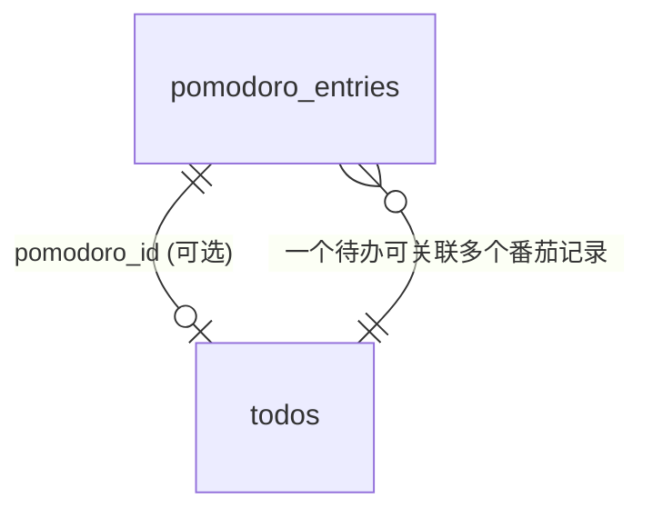

# POMATO 待办与提醒功能 —— 需求分析与技术设计文档

> **版本**: v1.1  
> **日期**: 2026-06-11  
> **状态**: ✅ 已实现 (Phase A + Phase B 全部完成)  
> **关联项目**: POMATO 番茄日志助手（Python 3.13 + PyQt6 + SQLite）

---

## 目录

- [第一部分：市场需求分析文档 (MRD)](#第一部分市场需求分析文档-mrd)
  - [1. 需求来源与背景](#1-需求来源与背景)
  - [2. 目标用户画像](#2-目标用户画像)
  - [3. 核心用户故事](#3-核心用户故事)
  - [4. 功能需求规格](#4-功能需求规格)
  - [5. 非功能需求](#5-非功能需求)
  - [6. 竞品分析与差异化](#6-竞品分析与差异化)
  - [7. 成功指标](#7-成功指标)
  - [8. 风险与应对](#8-风险与应对)
- [第二部分：技术设计文档 (TSD)](#第二部分技术设计文档-tsd)
  - [9. 架构概览](#9-架构概览)
  - [10. 数据模型设计](#10-数据模型设计)
  - [11. 核心模块设计](#11-核心模块设计)
  - [12. UI/UX 设计](#12-uiux-设计)
  - [13. 与现有系统的集成](#13-与现有系统的集成)
  - [14. 实现路线图](#14-实现路线图)
  - [15. 测试策略](#15-测试策略)

---

# 第一部分：市场需求分析文档 (MRD)

---

## 1. 需求来源与背景

### 1.1 原始用户需求

> **"支持设置待办，支持到点提醒"**

### 1.2 需求深挖 —— 用户真正想要什么？

用户已经在用 POMATO 管理番茄钟计时和碎片化工作记录，但存在以下痛点：

| 痛点维度 | 具体表现 | 根因分析 |
|----------|----------|----------|
| **意图缺失** | 能记录"做了什么"，但无法提前规划"要做什么" | 缺少计划层——有记录无规划 |
| **时间盲区** | 番茄钟只管专注时段，会议/截止时间等固定时间点事件无法管理 | 缺少日历提醒能力 |
| **优先级混乱** | 一天开始不知道从哪件事入手，结束才发现重要的事没做 | 缺乏优先级排序和可视化 |
| **信息割裂** | 待办在别的 App（记事本/Todoist/钉钉），番茄记录在 POMATO | 工作流不闭环 |
| **遗忘风险** | 沉浸工作时容易忘记会议、忘记喝水、忘记某个时间点该做的事 | 缺少到点强提醒机制 |

### 1.3 一句话价值主张

> **让 POMATO 从"记录你做了什么"升级为"帮你规划并提醒该做什么"——计划、计时、记录、提醒，一个 App 闭环。**

---

## 2. 目标用户画像

| 画像 | 特征 | 典型场景 |
|------|------|----------|
| **独立开发者** | 一人多角色，无人提醒，容易沉浸过深忘记会议和时间节点 | "下午3点要和客户 demo，但写代码写着写着就忘了" |
| **远程办公者** | 在家工作，缺乏办公室环境的时间锚点 | "没人走过来说'开会了'，全靠自己记" |
| **知识工作者** | 任务碎片化，多个项目并行 | "今天有5件事要做，哪件先做？做了几件？" |
| **学生/研究人员** | 论文、实验、课程多项并行 | "论文修改截止时间是周五，但今天周三了还没开始" |

---

## 3. 核心用户故事

```
US-T1  作为用户，我希望上班前能快速列出今天要做的事，按优先级排列
US-T2  作为用户，在番茄钟弹窗记录时，能一键将正在做的待办标记为完成
US-T3  作为用户，我可以为重要事项设定具体提醒时间（如15:00 开会），到点强弹窗提醒
US-T4  作为用户，某条待办超时未完成时，自动顺延或提示是否继续
US-T5  作为用户，今日看板同时展示「待办列表」+「已完成记录」，一目了然
US-T6  作为用户，AI日报能引用今日待办的完成情况（完成了 X/Y 项计划任务）
US-T7  作为用户，支持重复提醒（每日站会 09:30、每周五周报 17:00）
US-T8  作为用户，未完成的待办自动结转至次日，不丢失
```

---

## 4. 功能需求规格

### 模块 F7：待办管理 (To-Do Management)

| 需求ID | 描述 | 优先级 | 用户故事 |
|--------|------|--------|----------|
| F7-01 | 创建待办：标题、优先级（高/中/低）、截止日期、备注 | P0 | US-T1 |
| F7-02 | 待办列表展示：按优先级排序，支持拖拽调整顺序 | P0 | US-T1 |
| F7-03 | 待办状态：待开始 / 进行中 / 已完成 | P0 | US-T2 |
| F7-04 | 番茄弹窗中显示当前待办列表，支持一键勾选完成 | P1 | US-T2 |
| F7-05 | 手动标记完成/取消完成 | P1 | — |
| F7-06 | 编辑/删除待办 | P1 | — |
| F7-07 | 待办关联番茄钟条目（某条记录属于哪个待办） | P2 | — |

### 模块 F8：定时提醒 (Scheduled Reminders)

| 需求ID | 描述 | 优先级 | 用户故事 |
|--------|------|--------|----------|
| F8-01 | 创建提醒：标题、提醒时间、是否重复、重复规则 | P0 | US-T3 |
| F8-02 | 到点强弹窗提醒（置顶+提示音+托盘气泡） | P0 | US-T3 |
| F8-03 | 提醒弹窗支持"知道了"/"延后10分钟"操作 | P0 | — |
| F8-04 | 支持一次性提醒和重复提醒（每日/每周/工作日） | P1 | US-T7 |
| F8-05 | 提醒列表管理：查看/编辑/删除/启用禁用 | P1 | — |
| F8-06 | 提醒与番茄钟计时互不冲突（弹窗排队机制） | P0 | — |
| F8-07 | 提醒错过时（如电脑关机）下次启动补提醒 | P2 | — |

### 模块 F9：今日看板增强（新 UI 融合）

| 需求ID | 描述 | 优先级 | 用户故事 |
|--------|------|--------|----------|
| F9-01 | 看板顶部区域：待办卡片列表 | P0 | US-T5 |
| F9-02 | 看板中部区域：提醒时间线 | P1 | — |
| F9-03 | 看板底部区域：番茄钟记录（现有功能增强） | P0 | — |
| F9-04 | 标题栏显示"待办完成进度 X/Y" | P1 | — |
| F9-05 | 未完成待办自动结转至次日（可关闭） | P2 | US-T8 |

### 模块 F10：AI 日报增强

| 需求ID | 描述 | 优先级 |
|--------|------|--------|
| F10-01 | Prompt 中注入今日待办完成情况 | P1 |
| F10-02 | 日报摘要显示"计划 X 项，完成 Y 项，完成率 Z%" | P1 |

---

## 5. 非功能需求

| 类别 | 要求 |
|------|------|
| **性能** | 提醒触发延迟 < 1s（基于 1s tick）；待办列表 200 条以内渲染 < 100ms |
| **可靠性** | 提醒不因番茄钟状态机阻塞而丢失；异常退出后提醒数据不丢 |
| **数据一致** | 待办与番茄条目关联关系保持引用完整性 |
| **内存** | 新增模块后内存增长 < 10MB（目标总 < 60MB） |
| **兼容性** | 不影响现有番茄钟计时、弹窗记录、AI 日报功能 |
| **扩展性** | 待办可独立使用（不强制启动番茄计时） |

---

## 6. 竞品分析与差异化

| 竞品 | 番茄钟 | 待办 | 提醒 | 日报 | 本地+离线 |
|------|--------|------|------|------|-----------|
| **Todoist** | ❌ | ✅ | ✅ | ❌ | ❌ 云端 |
| **TickTick** | ✅ | ✅ | ✅ | ❌ | ❌ 云端 |
| **番茄ToDo** | ✅ | ✅ | ❌ | ❌ | 部分 |
| **Forest** | ✅ | ❌ | ❌ | ❌ | ✅ |
| **POMATO v2.0** | ✅ | ✅ | ✅ | ✅ AI | ✅ 本地 |

> **POMATO 核心差异化优势**：番茄计时 + 待办规划 + 定时提醒 + AI 日报 → **一站式本地工作流闭环**，无需联网即可完成"计划-执行-记录-总结"全流程。

---

## 7. 成功指标

| 指标 | 目标值 | 衡量方式 |
|------|--------|----------|
| 待办创建频率 | 日活用户日均创建 ≥3 条 | DB 统计 |
| 待办完成率 | ≥60% 的待办在截止日前完成 | DB 统计 |
| 提醒准时率 | 100%（1s 误差内） | 日志 |
| 弹窗冲突率 | <1%（提醒弹窗与番茄弹窗冲突） | 日志 |
| 功能可用率 | 不与现有功能互斥 | 全量回归测试通过 |

---

## 8. 风险与应对

| 风险 | 概率 | 影响 | 应对策略 |
|------|------|------|----------|
| 提醒弹窗与番茄完成弹窗同时触发 | 中 | 用户困扰 | 弹窗队列机制：先进先出，最多排队 2 个 |
| 待办过多导致界面卡顿 | 低 | 体验差 | 虚拟列表 + 分页 + 默认收起已完成 |
| 提醒在非工作时间触发 | 低 | 骚扰 | 允许设置"工作时间外静默" |
| 用户觉得功能太多变复杂 | 中 | 弃用 | 模块化显示：默认折叠待办/提醒区，按需展开 |

---

# 第二部分：技术设计文档 (TSD)

---

## 9. 架构概览

### 9.1 现有架构回顾

```
┌─────────────────────────────────────────────────────────┐
│  主线程 (Qt Event Loop)                                  │
│                                                         │
│  QTimer (1s) ──→ TimerEngine._on_tick()                 │
│                   ├── IDLE: 检查是否启动番茄钟            │
│                   ├── WORK: 倒计时 → 到期触发弹窗         │
│                   └── BREAK: 倒计时 → 到期开始新番茄      │
│                                                         │
│  TrayManager ──→ 信号接线 + 弹窗 + 主窗口生命周期         │
│  MainWindow  ──→ 今日看板 UI + 增删改查                  │
│  Database    ──→ SQLite 同步读写（主线程，无连接池）       │
│  Config      ──→ JSON 文件持久化 (~/.pomato/config.json) │
│                                                         │
│  临时线程: _AIWorker(QThread) —— 仅在生成日报时创建       │
└─────────────────────────────────────────────────────────┘
```

### 9.2 新增模块架构

```
                            ┌─────────────────────┐
                            │   ReminderEngine    │  ← 新增
                            │  (QObject, 无独立线程) │
                            │                     │
                            │  - 待办 CRUD        │
                            │  - 提醒调度          │
                            │  - 自动结转          │
                            └──────┬──────────────┘
                                   │
       ┌───────────────────────────┼───────────────────────────┐
       │                           │                           │
       ▼                           ▼                           ▼
┌──────────────┐          ┌──────────────┐          ┌──────────────┐
│  Database    │          │ TimerEngine  │          │ TrayManager  │
│  (新增3表)   │          │ (复用1s tick) │          │ (新增信号)   │
└──────────────┘          └──────────────┘          └──────────────┘
       │                                                   │
       ▼                                                   ▼
┌──────────────┐                                  ┌──────────────┐
│  待办+提醒    │                                  │ 提醒弹窗      │
│  SQLite 表   │                                  │ ReminderPopup │
└──────────────┘                                  └──────────────┘
```

**关键设计决策：零新线程**

- `ReminderEngine` 复用 `TimerEngine` 现有的 1s QTimer tick，不在每次 tick 中做数据库查询
- 在 tick 中仅做**内存比较**（当前时间 vs 已加载的提醒列表），O(n) 扫描 n 条提醒（通常 < 20 条），耗时 < 0.1ms
- 弹窗冲突通过**队列机制**解决，不引入线程同步复杂度

---

## 10. 数据模型设计

### 10.1 新增表：`todos`（待办事项）

```sql
CREATE TABLE IF NOT EXISTS todos (
    id          INTEGER PRIMARY KEY AUTOINCREMENT,
    title       TEXT    NOT NULL,             -- 待办标题
    priority    INTEGER NOT NULL DEFAULT 1,   -- 0=低 1=中 2=高
    status      TEXT    NOT NULL DEFAULT 'pending',  -- pending | in_progress | done
    due_date    TEXT,                         -- 截止日期 (YYYY-MM-DD)，可空
    note        TEXT    DEFAULT '',           -- 备注
    sort_order  INTEGER NOT NULL DEFAULT 0,   -- 拖拽排序序号
    pomodoro_id INTEGER,                      -- 关联的番茄钟条目 ID（可空）
    created_at  TEXT    NOT NULL,
    updated_at  TEXT    NOT NULL,
    FOREIGN KEY (pomodoro_id) REFERENCES pomodoro_entries(id) ON DELETE SET NULL
);

CREATE INDEX IF NOT EXISTS idx_todos_status ON todos(status);
CREATE INDEX IF NOT EXISTS idx_todos_due_date ON todos(due_date);
```

### 10.2 新增表：`reminders`（定时提醒）

```sql
CREATE TABLE IF NOT EXISTS reminders (
    id          INTEGER PRIMARY KEY AUTOINCREMENT,
    title       TEXT    NOT NULL,             -- 提醒标题
    remind_time TEXT    NOT NULL,             -- 提醒时间 (HH:MM 格式)
    repeat_type TEXT    NOT NULL DEFAULT 'none',  -- none | daily | weekly | weekday
    repeat_days TEXT    DEFAULT '',           -- weekly 时存放 "1,3,5" (周几)
    enabled     INTEGER NOT NULL DEFAULT 1,   -- 是否启用
    snooze_min  INTEGER NOT NULL DEFAULT 10,  -- 延后分钟数
    last_triggered TEXT,                      -- 上次触发日期，防同一天重复触发
    created_at  TEXT    NOT NULL,
    updated_at  TEXT    NOT NULL
);

CREATE INDEX IF NOT EXISTS idx_reminders_enabled ON reminders(enabled);
```

### 10.3 新增配置项（`config.json` 新增 key）

```json
{
    "todo_auto_carry_over": true,
    "reminder_silent_outside_work": false,
    "reminder_popup_timeout_seconds": 120,
    "show_completed_todos": true
}
```

### 10.4 与现有表的关联关系



> `todos.pomodoro_id` 字段当用户在番茄弹窗中标记某待办为完成时写入，实现待办与番茄记录的弱关联。

---

## 11. 核心模块设计

### 11.1 `src/ui/reminder_engine.py` —— 新增核心模块

```python
"""
reminder_engine.py — 待办管理 + 定时提醒引擎

设计原则：
- 零新线程，复用 TimerEngine 的 1s QTimer tick
- 内存中维护已加载的提醒列表，tick 时仅做时间比较
- 提醒触发信号通过 TrayManager 连接到弹窗
"""

from datetime import datetime, date, time
from enum import Enum
from PyQt6.QtCore import QObject, pyqtSignal


class TodoStatus(str, Enum):
    PENDING = "pending"
    IN_PROGRESS = "in_progress"
    DONE = "done"


class RepeatType(str, Enum):
    NONE = "none"
    DAILY = "daily"
    WEEKLY = "weekly"
    WEEKDAY = "weekday"


class ReminderEngine(QObject):
    # ---- 信号 ----

    # 提醒触发：(reminder_id, title, remind_time_str)
    reminder_triggered = pyqtSignal(int, str, str)

    # 待办变更通知
    todos_changed = pyqtSignal()


    def __init__(self, config, db):
        super().__init__()
        self.config = config
        self.db = db
        self._reminders: list[dict] = []   # 内存缓存
        self._triggered_today: set[int] = set()
        self._reload_reminders()

    # ================================================================
    # 提醒管理
    # ================================================================

    def _reload_reminders(self):
        """从 DB 重载所有启用的提醒到内存。"""
        today = date.today().isoformat()
        self._reminders = self.db.get_enabled_reminders()
        # 重建今日已触发集合
        self._triggered_today = {
            r["id"] for r in self._reminders
            if r.get("last_triggered") == today
        }

    def add_reminder(self, title, remind_time, repeat_type="none",
                     repeat_days="", snooze_min=10):
        rid = self.db.add_reminder(title, remind_time, repeat_type,
                                   repeat_days, snooze_min)
        self._reload_reminders()
        return rid

    def update_reminder(self, reminder_id, **kwargs):
        self.db.update_reminder(reminder_id, **kwargs)
        self._reload_reminders()

    def delete_reminder(self, reminder_id):
        self.db.delete_reminder(reminder_id)
        self._reload_reminders()

    def snooze_reminder(self, reminder_id):
        """延后提醒（默认 10 分钟）。"""
        r = self.db.get_reminder(reminder_id)
        if not r:
            return
        snooze_min = r.get("snooze_min", 10)
        now = datetime.now()
        new_time = (now.hour * 60 + now.minute + snooze_min) % (24 * 60)
        h, m = divmod(new_time, 60)
        new_time_str = f"{h:02d}:{m:02d}"
        # 临时修改提醒时间（当天有效）
        self.db.update_reminder(reminder_id,
                                remind_time=new_time_str,
                                last_triggered=None)  # 清除已触发标记
        self._reload_reminders()

    # ================================================================
    # 待办管理
    # ================================================================

    def add_todo(self, title, priority=1, due_date=None, note=""):
        tid = self.db.add_todo(title, priority, due_date, note)
        self.todos_changed.emit()
        return tid

    def update_todo(self, todo_id, **kwargs):
        self.db.update_todo(todo_id, **kwargs)
        self.todos_changed.emit()

    def delete_todo(self, todo_id):
        self.db.delete_todo(todo_id)
        self.todos_changed.emit()

    def get_todos(self, date_str=None, include_done=True):
        return self.db.get_todos(date_str=date_str, include_done=include_done)

    def carry_over_pending_todos(self):
        """将昨日未完成的待办结转至今日。"""
        if not self.config.get("todo_auto_carry_over", True):
            return
        yesterday = date.today()
        # ... 查询昨日 pending/in_progress 待办，复制到今日

    # ================================================================
    # 每秒 tick（由 TimerEngine 的 QTimer 触发）
    # ================================================================

    def on_tick(self):
        """在 TimerEngine._on_tick() 末尾调用。"""
        now = datetime.now()
        current_time_str = f"{now.hour:02d}:{now.minute:02d}"
        today_str = now.date().isoformat()
        weekday = now.weekday()  # 0=Mon

        for r in self._reminders:
            if not r["enabled"]:
                continue

            # 检查是否今天已触发过
            if r.get("last_triggered") == today_str:
                continue

            # 检查时间是否匹配
            if r["remind_time"] != current_time_str:
                continue

            # 检查重复规则
            if r["repeat_type"] == RepeatType.WEEKDAY and weekday >= 5:
                continue
            if r["repeat_type"] == RepeatType.WEEKLY:
                days = r.get("repeat_days", "").split(",")
                if str(weekday) not in days:
                    continue

            # 触发！
            self.db.mark_reminder_triggered(r["id"], today_str)
            self._triggered_today.add(r["id"])
            self.reminder_triggered.emit(r["id"], r["title"], r["remind_time"])
```

### 11.2 `src/core/database.py` —— 新增方法

```python
# ==================== 待办 ====================

def add_todo(self, title, priority=1, due_date=None, note=""):
    now = datetime.now().isoformat()
    with self._get_conn() as conn:
        max_order = conn.execute(
            "SELECT COALESCE(MAX(sort_order), -1) FROM todos WHERE status != 'done'"
        ).fetchone()[0]
        cursor = conn.execute(
            """INSERT INTO todos (title, priority, status, due_date, note, sort_order, created_at, updated_at)
               VALUES (?, ?, 'pending', ?, ?, ?, ?, ?)""",
            (title, priority, due_date, note, max_order + 1, now, now),
        )
        return cursor.lastrowid

def get_todos(self, date_str=None, include_done=True):
    with self._get_conn() as conn:
        sql = "SELECT * FROM todos"
        conditions = []
        params = []
        if date_str:
            conditions.append("(due_date=? OR due_date IS NULL)")
            params.append(date_str)
        if not include_done:
            conditions.append("status != 'done'")
        if conditions:
            sql += " WHERE " + " AND ".join(conditions)
        sql += " ORDER BY priority DESC, sort_order ASC"
        rows = conn.execute(sql, params).fetchall()
    return [dict(row) for row in rows]

def update_todo(self, todo_id, **kwargs):
    valid = {"title", "priority", "status", "due_date", "note", "sort_order", "pomodoro_id"}
    updates = {k: v for k, v in kwargs.items() if k in valid}
    if not updates:
        return
    updates["updated_at"] = datetime.now().isoformat()
    set_clause = ", ".join(f"{k}=?" for k in updates)
    values = list(updates.values()) + [todo_id]
    with self._get_conn() as conn:
        conn.execute(f"UPDATE todos SET {set_clause} WHERE id=?", values)

def delete_todo(self, todo_id):
    with self._get_conn() as conn:
        conn.execute("DELETE FROM todos WHERE id=?", (todo_id,))

# ==================== 提醒 ====================

def add_reminder(self, title, remind_time, repeat_type, repeat_days, snooze_min):
    now = datetime.now().isoformat()
    with self._get_conn() as conn:
        cursor = conn.execute(
            """INSERT INTO reminders (title, remind_time, repeat_type, repeat_days,
               snooze_min, enabled, created_at, updated_at)
               VALUES (?, ?, ?, ?, ?, 1, ?, ?)""",
            (title, remind_time, repeat_type, repeat_days, snooze_min, now, now),
        )
        return cursor.lastrowid

def get_enabled_reminders(self):
    with self._get_conn() as conn:
        rows = conn.execute(
            "SELECT * FROM reminders WHERE enabled=1"
        ).fetchall()
    return [dict(row) for row in rows]

def get_reminder(self, reminder_id):
    with self._get_conn() as conn:
        row = conn.execute(
            "SELECT * FROM reminders WHERE id=?", (reminder_id,)
        ).fetchone()
    return dict(row) if row else None

def update_reminder(self, reminder_id, **kwargs):
    valid = {"title", "remind_time", "repeat_type", "repeat_days",
             "enabled", "snooze_min", "last_triggered"}
    updates = {k: v for k, v in kwargs.items() if k in valid}
    if not updates:
        return
    updates["updated_at"] = datetime.now().isoformat()
    set_clause = ", ".join(f"{k}=?" for k in updates)
    values = list(updates.values()) + [reminder_id]
    with self._get_conn() as conn:
        conn.execute(f"UPDATE reminders SET {set_clause} WHERE id=?", values)

def delete_reminder(self, reminder_id):
    with self._get_conn() as conn:
        conn.execute("DELETE FROM reminders WHERE id=?", (reminder_id,))

def mark_reminder_triggered(self, reminder_id, date_str):
    """标记提醒在今天已触发，防止同一天重复提醒。"""
    with self._get_conn() as conn:
        conn.execute(
            "UPDATE reminders SET last_triggered=?, updated_at=? WHERE id=?",
            (date_str, datetime.now().isoformat(), reminder_id),
        )

def get_all_reminders(self):
    with self._get_conn() as conn:
        rows = conn.execute("SELECT * FROM reminders ORDER BY remind_time").fetchall()
    return [dict(row) for row in rows]
```

### 11.3 弹窗队列机制（`tray_manager.py` 增强）

```
现有弹窗生命周期：
  番茄钟结束 → PopupWindow（记录内容 / 跳过）
  
新增弹窗生命周期：
  提醒触发 → ReminderPopup（知道了 / 延后）

冲突处理策略（FIFO 队列）：
  
  ┌──────────────────────────────────────────────────┐
  │              弹窗队列 (deque, maxlen=2)            │
  │                                                  │
  │  队首 [PopupWindow(番茄)]  ← 当前正在显示          │
  │  队尾 [ReminderPopup(提醒)] ← 等待中               │
  │                                                  │
  │  规则：                                          │
  │  1. 队列满时，新的提醒弹窗替换队尾（丢弃旧的）      │
  │  2. 番茄弹窗优先级最高，不替换番茄弹窗              │
  │  3. 当前弹窗关闭后，自动弹出下一个                  │
  └──────────────────────────────────────────────────┘
```

### 11.4 `src/ui/reminder_popup.py` —— 提醒弹窗（新增文件）

```python
"""
reminder_popup.py — 到点提醒弹窗

设计参考现有 PopupWindow：
- 强制置顶 (WindowStaysOnTopHint + ctypes setForegroundWindow)
- 超时自动关闭
- 快捷操作按钮
- Ctrl+Enter / Esc 快捷键
"""

class ReminderPopup(QDialog):
    def __init__(self, reminder_id, title, remind_time, on_snooze, on_dismiss, parent=None):
        # 布局：
        # ┌─────────────────────────────────────┐
        # │  🔔 提醒                             │
        # │─────────────────────────────────────│
        # │  "15:00 项目周会"                     │
        # │                                     │
        # │  [⏰ 延后10分钟]   [✓ 知道了]         │
        # └─────────────────────────────────────┘
        ...
```

### 11.5 `main_window.py` —— 两阶段布局

**Phase A（方案四）：主窗口零改动**

```
现有布局完全不变：
┌─────────────────────┐
│ 日期导航 + 统计      │
├─────────────────────┤
│                     │
│   番茄记录列表       │
│                     │
├─────────────────────┤
│  ▶ 开始  ＋ 补录     │
└─────────────────────┘
```

待办和提醒通过 **托盘右键菜单** → 独立弹窗访问。

**Phase B（方案二）：Tab 标签页**

```
┌─────────────────────────────┐
│  📅 2026-06-09 · 今日        │
│  🍅 5个  ⏳ 125分钟          │
├─────────────────────────────┤
│ [🍅 番茄(5)] [📋 待办(3)] [⏰ 提醒] │  ← QTabWidget
├─────────────────────────────┤
│                             │
│  🍅 Tab (默认激活):          │
│  #1 09:00 完成登录测试 [开发] │
│  #2 09:30 修复边界case [测试] │
│  ...                        │
│  [+ 添加条目]                │
│                             │
├─────────────────────────────┤
│  ▶ 手动开始                  │
└─────────────────────────────┘

📋 Tab 内容 (复用 TodoListWidget):
  [高] 完成接口文档  □
  [中] 修复登录Bug   ✓
  [低] 整理周报      □
  [+] 添加待办

⏰ Tab 内容 (复用 ReminderListWidget):
  09:30 每日站会   (每日)
  15:00 项目周会   (单次)
  [+] 添加提醒
```

| 对比 | Phase A (方案四) | Phase B (方案二) |
|------|:--:|:--:|
| `main_window.py` 改动 | **零行** | +~40 行 |
| 待办/提醒组件 | TodoListWidget / ReminderListWidget（同一套） |
| 容器 | QDialog 薄壳 | QTabWidget Tab |
| 用户访问方式 | 托盘右键 → 弹窗 | 主窗口内点击 Tab |

### 11.6 `popup_window.py` —— 番茄弹窗增强

在现有弹窗底部增加"关联待办"行：

```
┌─────────────────────────────────────┐
│  🍅 第 3 个番茄钟完成！              │
│─────────────────────────────────────│
│  过去25分钟，你做了什么？             │
│  ┌───────────────────────────────┐  │
│  │ 完成了用户登录模块的单元测试    │  │
│  └───────────────────────────────┘  │
│                                     │
│  标签: [开发✓] [测试✓] [会议] [文档] │
│                                     │
│  关联待办: [完成接口文档 ▾]  ✓ 已完成 │  ← 新增
│                                     │
│  [跳过本轮]        [✓ 提交 Ctrl+↵]   │
└─────────────────────────────────────┘
```

### 11.7 `settings_window.py` —— 设置面板增强

在"其他"分组中新增 3 个配置项：

| 配置项 | 控件类型 | 默认值 |
|--------|----------|--------|
| 未完成待办自动结转 | `QCheckBox` | 开启 |
| 非工作时间提醒静默 | `QCheckBox` | 关闭 |
| 提醒弹窗超时 | `QSpinBox` (30-600s) | 120s |

新增"提醒管理"分组：
- `QListWidget` 显示所有提醒
- 添加/编辑/删除/启用禁用按钮
- 编辑弹窗：标题 + 时间 + 重复规则 + 延后分钟

---

## 12. UI/UX 设计

### 12.1 提醒弹窗设计

```
┌─────────────────────────────────────┐
│  🔔 到点提醒                         │
│─────────────────────────────────────│
│                                     │
│      ⏰  15:00                       │
│                                     │
│      项目周会                         │
│                                     │
│─────────────────────────────────────│
│  [⏰ 延后10分钟]     [✓ 知道了]       │
└─────────────────────────────────────┘
```

- 尺寸：320×200，居中显示
- `WindowStaysOnTopHint` + ctypes 强制置顶
- 超时 120 秒自动关闭（可配置）
- 延后按钮 → 调用 `reminder_engine.snooze_reminder()`

### 12.2 待办卡片设计

```
┌──────────────────────────────────┐
│ ● 高优先级                        │
│ 完成用户模块单元测试                │
│ 截止: 2026-06-08  ──────── □ ✓   │
└──────────────────────────────────┘
┌──────────────────────────────────┐
│ ○ 中优先级                        │
│ 更新 API 文档                     │
│ 截止: 2026-06-09  ──────── □     │
└──────────────────────────────────┘
```

- 颜色标识：红色边框（高）、橙色边框（中）、灰色边框（低）
- 点击待办标题→进入编辑模式
- 拖拽手柄→调整优先级/顺序
- 勾选框→一键标记完成

---

## 13. 与现有系统的集成

### 13.1 信号连接图

```
TimerEngine                     ReminderEngine
    │                                │
    │ QTimer (1s)                    │
    ├── _on_tick()                   │
    │   ├── [现有逻辑]               │
    │   ├── 状态检查                  │
    │   ├── 自动启动                  │
    │   └── 倒计时处理                │
    │                                │
    └── → reminder_engine.on_tick() ─┘  ← 新增 1 行调用
             │
             ├── reminder_triggered ──→ TrayManager._on_reminder_triggered()
             │                                │
             │                                ├── 检查弹窗队列
             │                                ├── 如果空闲 → 显示 ReminderPopup
             │                                └── 如果忙碌 → 入队
             │
             └── todos_changed ──→ MainWindow.refresh()
```

### 13.2 数据库初始化增强

在 `Database._init_db()` 中新增 `todos` 和 `reminders` 表的 CREATE TABLE 语句。

### 13.3 配置扩展

在 `config.py` 的 `DEFAULT_CONFIG` 中新增 4 个 key（见 10.3 节）。

### 13.4 主入口 (`main.py`) 改动

```python
# 现有：
reminder_engine = ReminderEngine(config, db)
tray_manager = TrayManager(app, config, db, timer, reminder_engine)  # 新增参数

# TrayManager 内部：
self.reminder_engine.reminder_triggered.connect(self._on_reminder_triggered)
```

---

## 14. 实现路线图（方案四 → 方案二渐进路线）

```
Phase A — 方案四：托盘 + 独立弹窗（3-4 天）
├── 阶段 A1: 基础数据与引擎
│   ├── 新增数据库表 (todos, reminders)
│   ├── ReminderEngine 核心逻辑（待办/提醒 CRUD + tick）
│   ├── TimerEngine._on_tick() 末尾集成 1 行调用
│   └── Config 默认值扩展（4 个新 key）
├── 阶段 A2: UI 组件
│   ├── TodoListWidget（自包含待办列表，可嵌入任何容器）
│   ├── ReminderListWidget（自包含提醒列表）
│   ├── TodoDialog（薄壳 QDialog 包装 TodoListWidget）
│   ├── ReminderDialog（薄壳 QDialog 包装 ReminderListWidget）
│   └── ReminderPopup（到点强弹窗提醒）
├── 阶段 A3: 集成
│   ├── TrayManager 新增右键菜单「📋 待办」「⏰ 提醒」
│   ├── 弹窗队列机制（FIFO, maxlen=2）
│   ├── 设置面板提醒管理
│   └── main.py 初始化 ReminderEngine
└── 阶段 A4: 测试
    ├── ReminderEngine 单元测试（30+ 用例）
    ├── 弹窗队列测试
    └── 全量回归（现有 202 个测试）

                    │
                    │  用户反馈驱动
                    ▼

Phase B — 迁入方案二：Tab 标签页（1-2 天）
├── MainWindow 新增 QTabWidget（🍅番茄 / 📋待办 / ⏰提醒）
├── 复用 Phase A 的 TodoListWidget 和 ReminderListWidget
│     （不修改 Widget 内部任何代码）
├── 删除 TodoDialog 和 ReminderDialog 两个薄壳
└── 托盘右键菜单改为切换 Tab（或保留 Dialog 入口作为快捷方式）

总计预估: 4-6 天 (Phase A) + 1-2 天 (Phase B) = 5-8 天
```

**Phase A → Phase B 迁移成本极低的原因**：

```python
# TodoListWidget 自包含所有逻辑，Dialog 只是薄壳

class TodoListWidget(QWidget):
    """待办列表组件——可嵌入 Dialog、Tab、或任何容器"""
    todo_added = pyqtSignal(str, int, str, str)
    todo_status_changed = pyqtSignal(int, str)

    def __init__(self, reminder_engine, parent=None):
        self._engine = reminder_engine
        self._engine.todos_changed.connect(self.refresh)
        # ... 所有 UI、交互、拖拽排序都在这里

# Phase A: 薄壳 Dialog（~30 行）
class TodoDialog(QDialog):
    def __init__(self, engine, parent=None):
        self._list = TodoListWidget(engine, self)  # 唯一实质内容
        layout = QVBoxLayout(self)
        layout.addWidget(self._list)

# Phase B: 嵌入 Tab（复用同一个 TodoListWidget）
class MainWindow(QMainWindow):
    def _setup_ui(self):
        self._tabs = QTabWidget()
        self._tabs.addTab(self._tomato_area, "🍅 番茄")
        self._tabs.addTab(TodoListWidget(engine), "📋 待办")     # 完全相同
        self._tabs.addTab(ReminderListWidget(engine), "⏰ 提醒")  # 完全相同
```

**Phase B 触发条件**（满足任意两条即升级）：
- 用户日均手动打开 TodoDialog ≥ 5 次
- 窗口使用尺寸普遍 ≥ 800×700
- 用户反馈"待办应该和番茄记录在一起"
- 番茄弹窗关联待办的下拉体验不够好（需要看到完整列表）

---

## 15. 测试策略

### 15.1 新增测试文件

| 测试文件 | 覆盖内容 | 预估用例数 |
|----------|----------|------------|
| `tests/test_reminder_engine.py` | 提醒 CRUD、触发逻辑、重复规则、延后、自动结转 | 30+ |
| `tests/test_reminder_popup.py` | 弹窗显示、超时、按钮行为、快捷键 | 10+ |
| `tests/test_popup_queue.py` | 弹窗队列 FIFO、满队列替换、番茄弹窗优先 | 8+ |

### 15.2 关键测试用例

```
✓ test_reminder_triggers_at_exact_time          # 到点精准触发
✓ test_reminder_not_triggered_twice_same_day    # 同一天不重复触发
✓ test_daily_reminder_triggers_every_day        # 每日重复
✓ test_weekday_reminder_skips_weekend           # 工作日提醒跳过周末
✓ test_weekly_reminder_on_specified_days        # 指定周几触发
✓ test_disabled_reminder_not_triggered          # 禁用不触发
✓ test_snooze_reschedules_reminder              # 延后功能
✓ test_todo_carry_over_to_next_day              # 待办结转
✓ test_popup_queue_fifo_order                   # 弹窗队列顺序
✓ test_popup_queue_full_drops_oldest            # 队列满丢弃
✓ test_tomato_popup_priority_over_reminder       # 番茄弹窗优先
✓ test_reminder_does_not_block_timer_engine      # 提醒不阻塞计时
✓ test_complete_regression_202_tests_pass        # 全量回归
```

---

## 附录 A：文件变更清单（两阶段）

### Phase A — 方案四：托盘 + 独立弹窗

| 操作 | 文件路径 | 说明 |
|------|----------|------|
| **新增** | `src/ui/reminder_engine.py` | 待办 + 提醒引擎 |
| **新增** | `src/ui/todo_list_widget.py` | 待办列表组件（自包含，可嵌入任何容器） |
| **新增** | `src/ui/reminder_list_widget.py` | 提醒列表组件（同上） |
| **新增** | `src/ui/todo_dialog.py` | 待办弹窗——薄壳 QDialog 包装 TodoListWidget |
| **新增** | `src/ui/reminder_dialog.py` | 提醒管理弹窗——薄壳 QDialog 包装 ReminderListWidget |
| **新增** | `src/ui/reminder_popup.py` | 提醒弹窗组件（到点强弹窗） |
| 修改 | `src/core/database.py` | 新增 todos/reminders 表和方法（+~120 行） |
| 修改 | `src/core/config.py` | DEFAULT_CONFIG 扩展（+4 个 key） |
| 修改 | `src/services/timer_engine.py` | `_on_tick()` 末尾增加 1 行调用 |
| 修改 | `src/app.py` | 新增 2 个右键菜单项 + ReminderEngine 信号接线 + 弹窗队列 |
| 修改 | `src/ui/popup_window.py` | 番茄弹窗增加关联待办下拉（+~20 行） |
| 修改 | `src/ui/settings_window.py` | 设置面板增加提醒管理和 3 个配置项 |
| 修改 | `main.py` | 初始化 ReminderEngine 并传入 TrayManager |
| **不动** | `src/ui/main_window.py` | **零改动** |
| **新增** | `tests/test_reminder_engine.py` | 提醒引擎测试（30+ 用例） |
| **新增** | `tests/test_reminder_popup.py` | 提醒弹窗测试（10+ 用例） |
| **新增** | `tests/test_popup_queue.py` | 弹窗队列测试（8+ 用例） |
| 修改 | `docs/requirements.md` | 更新功能追踪表格 |

### Phase B — 迁入方案二：Tab 标签页

| 操作 | 文件路径 | 说明 |
|------|----------|------|
| 修改 | `src/ui/main_window.py` | 新增 QTabWidget，嵌入 TodoListWidget + ReminderListWidget（+~40 行） |
| **删除** | `src/ui/todo_dialog.py` | ~30 行薄壳，不再需要 |
| **删除** | `src/ui/reminder_dialog.py` | ~30 行薄壳，不再需要 |
| 可选 | `src/app.py` | 右键菜单改为切换 Tab（或保留 Dialog 入口作为快捷方式） |

> **关键**：Phase B 迁移时，`TodoListWidget` 和 `ReminderListWidget` **不需要任何修改**。数据层、引擎、测试全部不动。

---

## 附录 B：组件复用架构

```
                        ┌─────────────────────────┐
                        │    ReminderEngine        │
                        │  (todos_changed signal)  │
                        └────────────┬────────────┘
                                     │
              ┌──────────────────────┼──────────────────────┐
              │                      │                      │
              ▼                      ▼                      ▼
    ┌─────────────────┐  ┌─────────────────┐  ┌─────────────────┐
    │ TodoListWidget  │  │ReminderListWidg│  │ ReminderPopup   │
    │ (自包含组件)     │  │ (自包含组件)    │  │ (到点强弹窗)     │
    └────────┬────────┘  └────────┬────────┘  └─────────────────┘
             │                    │
    ┌────────┴────────┐  ┌───────┴────────┐
    │                 │  │                │
    ▼                 ▼  ▼                ▼
┌────────┐     ┌──────────────┐
│ Phase A│     │   Phase B    │
│        │     │              │
│TodoDlg │     │ QTabWidget   │
│(薄壳)  │     │  ├ 🍅 番茄   │
│        │     │  ├ 📋 待办 ← 复用 TodoListWidget
│RemDlg  │     │  └ ⏰ 提醒 ← 复用 ReminderListWidget
│(薄壳)  │     │              │
└────────┘     └──────────────┘
```

---

## 附录 C：看板布局方案对比分析

> 背景：当前 MainWindow 最小 600×460，顶部栏 56px + 统计栏 44px + 滚动区 ~304px + 底部 56px。每条番茄记录 50-70px，最小窗口仅可见 4-5 条。叠上待办(~150px) + 提醒(~80px)后只剩 1 条番茄记录可见。

---

### 方案一：垂直堆叠 + 可折叠（原设计文档方案）

```
┌─────────────────────────────┐
│  📅 2026-06-08 · 今日        │  ← Header
│  🍅 5个  ⏳ 125分钟          │  ← Stats
├─────────────────────────────┤
│ 📋 待办 (3)        ▲ 折叠    │  ← 始终可见标题行 + 计数
│  ┌──────────────────────┐   │
│  │ ● 完成接口文档        │   │  ← 默认展开 2 行预览
│  │ ○ 修复登录Bug    ✓   │   │
│  └──────────────────────┘   │
├─────────────────────────────┤
│ ⏰ 提醒 (2)        ▲ 折叠    │  ← 始终可见标题行 + 下一个提醒时间
│  09:30 每日站会              │
│  15:00 项目周会              │
├─────────────────────────────┤
│ 🍅 番茄钟记录 (5)            │
│  #1 09:00 完成登录测试  [开发]│
│  #2 09:30 修复边界case  [测试]│
│  ...                         │
│  [+ 添加条目]                 │  ← 内联添加按钮
├─────────────────────────────┤
│  ▶ 手动开始  ＋ 手动补录     │  ← Bottom
└─────────────────────────────┘
```

| 优点 | 缺点 |
|------|------|
| 一屏全览，信息不遗漏 | 小窗口下非常拥挤 |
| 实现最简单（QScrollArea 内嵌套） | 依赖用户手动折叠 |
| 不需要改变现有交互习惯 | 待办/提醒标题行始终占位(~30px each) |
| 改动最少 | 8+ 条番茄记录时必须滚很久 |

> **适用场景**：窗口较大（≥800×700）时体验最佳，适合习惯保持窗口全屏/大半屏的用户。

---

### 方案二：Tab 标签页切换

```
┌─────────────────────────────┐
│  📅 2026-06-08 · 今日        │
│  🍅 5个  ⏳ 125分钟          │
├─────────────────────────────┤
│  [📋 待办(3)] [🍅 番茄(5)] [⏰ 提醒] │  ← QTabBar
├─────────────────────────────┤
│                             │
│  Tab 内容区（无需折叠）       │  ← 每次只渲染一个 Tab
│                             │
│  ■ 待办 Tab:                │
│    ● 完成接口文档            │
│    ○ 修复登录Bug  ✓         │
│    [+] 添加待办              │
│                             │
│  ■ 番茄 Tab（默认激活）:      │
│    #1 09:00 完成登录测试     │
│    #2 09:30 修复边界case     │
│    ...                      │
│    [+ 添加条目]              │
│                             │
│  ■ 提醒 Tab:                │
│    09:30 每日站会 (每日)     │
│    15:00 项目周会 (单次)     │
│    [+] 添加提醒              │
├─────────────────────────────┤
│  ▶ 手动开始  ＋ 手动补录     │
└─────────────────────────────┘
```

| 优点 | 缺点 |
|------|------|
| 空间利用率最高——每个 Tab 独占全高 | 番茄弹窗无法看到待办（需跨 Tab 切换） |
| 每种内容专属空间，不互相挤占 | 增加了切换成本——用户需要记住"我在哪个Tab" |
| 实现中等难度（QTabWidget 即插即用） | 提醒触发时如果不在番茄Tab，可能错过上下文 |
| 自动避免信息过载 | "一览无余"感消失，违背原 US-T5 |

> **适用场景**：功能需求独立性强，用户在某个时刻只关注"计划"或"执行"或"提醒"之一。

---

### 方案三：左侧待办栏 + 右侧番茄记录（分割面板）

```
┌───────────┬──────────────────┐
│ 📋 待办    │ 📅 2026-06-08    │
│ 3 项      │ 🍅 5个 ⏳ 125分钟 │
│           ├──────────────────┤
│ ● 接口文档 │ 🍅 番茄钟记录 (5) │
│ ○ 修Bug ✓ │                  │
│ ○ 周报    │ #1 09:00 完成登录  │
│           │ #2 09:30 修复bug  │
│ ──────    │ #3 10:00 重构代码  │
│ ⏰ 提醒    │ #4 10:30 写测试    │
│ 09:30 站会│ #5 11:00 代码审查  │
│ 15:00 周会│                  │
│           │ [+] 添加条目      │
│ [+ 待办]  │                  │
│ [+ 提醒]  ├──────────────────┤
│           │ ▶ 开始  ＋ 补录   │
│ ← 200px → │ ←── flex 1 ────→ │
│ (固定)    │ (可缩放)          │
└───────────┴──────────────────┘
```

| 优点 | 缺点 |
|------|------|
| 计划与执行同屏，视觉不互相干扰 | 窗口需要 ≥ 750px 才好看（现有 min=600 不够） |
| 左侧待办可始终可见，右侧专注记录 | 需要提升最小窗口宽度到 750px |
| 接近 VS Code / Obsidian 的成熟交互模式 | 实现中等难度（QSplitter） |
| 待办勾选不打断番茄记录视图 | 提醒列表在左侧不够显眼 |

> **适用场景**：宽屏用户（1920×1080 及以上），习惯左右分栏的工具型布局。

---

### 方案四：托盘菜单 + 独立弹窗（保持主窗口清爽）

```
主窗口 (不新增任何模块):
┌─────────────────────────────┐
│  📅 2026-06-08 · 今日        │
│  🍅 5个  ⏳ 125分钟          │
├─────────────────────────────┤
│ 🍅 番茄钟记录                 │
│  #1 09:00 完成登录测试 [开发] │
│  #2 09:30 修复边界case [测试] │
│  ...                         │
│  [+ 添加条目]                 │
├─────────────────────────────┤
│  ▶ 开始  ＋ 补录              │
└─────────────────────────────┘

托盘菜单新增:                    独立弹窗 (按需弹出):
┌─────────────────┐            ┌─────────────────────┐
│ ⏱ 工作中 24:15  │            │ 📋 待办事项           │
│─────────────────│            │                     │
│ 📅 今日看板      │            │ ● 完成接口文档        │
│ 📋 待办事项  ←──┼── 点击弹出  │ ○ 修复登录Bug  ✓    │
│ ⏰ 提醒列表  ←──┼── 点击弹出  │ ○ 整理周报           │
│ 📋 生成日报      │            │ [+] 添加待办          │
│ ...             │            └─────────────────────┘
└─────────────────┘

到点提醒 → ReminderPopup（弹窗，非主窗口内容）
```

| 优点 | 缺点 |
|------|------|
| **主窗口完全不变**，零视觉污染 | 待办/提醒不在主窗口，违背 US-T5 |
| 实现最快，各自独立弹窗 | 用户需要额外点击才能看到待办 |
| 待办弹窗可自由调整大小和位置 | 计划与执行的关联感弱 |
| 不挤占番茄记录空间 | 多窗口管理增加复杂度 |

> **适用场景**：极度重视番茄记录视图清爽，愿意通过托盘快速访问待办/提醒。

---

### 方案五：时间线融合（统一视图）

```
┌─────────────────────────────┐
│  📅 2026-06-08 · 今日        │
│  待办 2/3  🍅 5个  ⏳ 125分  │
├─────────────────────────────┤
│  ⏰ 09:30  每日站会           │  ← 提醒
│ ─────────────────────────── │
│  #1 09:00-09:25              │
│  完成登录模块测试    [开发]    │
│ ─────────────────────────── │
│  #2 09:30-09:55              │
│  修复边界case bug   [测试]    │
│ ─────────────────────────── │
│  ● 完成接口文档 ← 正在进行     │  ← 待办（F7-07 关联）
│  #3 10:00-10:25              │
│  重构数据访问层      [开发]    │
│ ─────────────────────────── │
│  ○ 整理周报                  │  ← 未关联的待办
│ ─────────────────────────── │
│  ⏰ 15:00  项目周会           │  ← 提醒
│ ─────────────────────────── │
│  [+] 添加待办 / [+] 补录      │
├─────────────────────────────┤
│  ▶ 手动开始                  │
└─────────────────────────────┘
```

| 优点 | 缺点 |
|------|------|
| **最符合直觉**——时间就是线索，全部按时间排列 | 实现最复杂——三种数据源合并排序+渲染 |
| 用户不需要"切换视图"，一条时间线看全天 | 已完成番茄记录和未开始待办混排，语义不清 |
| 提醒在时间线上很显眼（带 ⏰ 标记） | 待办没有具体时间时放在哪？ |
| 类似 Google Calendar / Fantastical 的成熟范式 | 代码改动量大（EntryItem 需要多态渲染） |

> **适用场景**：对"一天全貌"有强烈需求的用户，偏爱日历式时间线。

---

### 综合对比矩阵

| 维度 | 方案一<br>折叠堆叠 | 方案二<br>Tab 切换 | 方案三<br>左右分栏 | 方案四<br>独立弹窗 | 方案五<br>时间线融合 |
|------|:--:|:--:|:--:|:--:|:--:|
| **主窗口清爽度** | ⭐⭐ | ⭐⭐⭐⭐ | ⭐⭐⭐ | ⭐⭐⭐⭐⭐ | ⭐⭐⭐ |
| **小窗口友好(600px宽)** | ⭐⭐ | ⭐⭐⭐⭐ | ⭐ | ⭐⭐⭐⭐⭐ | ⭐⭐⭐ |
| **一屏全览感** | ⭐⭐⭐⭐ | ⭐⭐ | ⭐⭐⭐⭐ | ⭐ | ⭐⭐⭐⭐⭐ |
| **实现复杂度** | ⭐⭐⭐⭐ (简单) | ⭐⭐⭐ | ⭐⭐⭐ | ⭐⭐⭐⭐⭐ (最简单) | ⭐ |
| **不改现有交互** | ⭐⭐⭐⭐ | ⭐⭐ | ⭐⭐⭐ | ⭐⭐⭐⭐⭐ | ⭐⭐ |
| **待办/记录关联感** | ⭐⭐⭐ | ⭐⭐ | ⭐⭐⭐⭐ | ⭐ | ⭐⭐⭐⭐⭐ |
| **改动文件数** | 1 个 | 1 个 | 1 个 | 0 (MainWindow 不变) | 2-3 个 |
| **需要提升最小窗口** | 否 | 否 | **是** (600→750) | 否 | 否 |

---

### 推荐策略：渐进式三阶段路线

不建议直接选定一个方案做到死，而是按用户接受度逐步演进：

```
Phase A (立即实现)        Phase B (观察反馈)        Phase C (基于反馈)
   方案四                    方案一                     方案三/五
┌──────────────┐     ┌──────────────┐         ┌──────────────┐
│ 主窗口完全不变 │ ──→ │ 顶部增加折叠区 │ ──→    │ 左右分栏 或   │
│ 托盘+独立弹窗  │     │ 默认折叠态     │        │ 时间线融合    │
│              │     │              │        │              │
│ 优点: 零风险  │     │ 优点: 过渡平滑 │        │ 优点: 终极体验 │
│ 代码量最小   │     │ 用户可自主打开 │        │ 需用户数据验证 │
└──────────────┘     └──────────────┘         └──────────────┘
```

**Phase A 为什么先做？**
1. 主窗口代码一行不动，现有 202 个测试完全不受影响
2. 待办 → 独立 `TodoDialog`（参考 `EditEntryDialog` 模式）
3. 提醒 → 独立 `ReminderDialog` + `ReminderPopup`（到点强弹窗不变）
4. 托盘右键菜单增加「📋 待办」「⏰ 提醒」两项
5. 让用户先用起来，收集真实反馈后再决定是否放入主窗口

**什么时候升级到 Phase B？**
- 用户反馈"待办要切出去看太麻烦" → 在主窗口顶部加可折叠待办区
- 用户反馈"提醒经常被忽略" → 提醒区放入主窗口

**什么时候考虑 Phase C？**
- 用户日均待办 > 5 条，且需要和番茄记录对照
- 窗口使用尺寸普遍 ≥ 900×700

---

### 选定方案：方案四 → 方案二渐进路线

> ✅ 已确认。**Phase A** 先以方案四（托盘 + 独立弹窗）实现，主窗口零改动。
> 用户实际使用后收集反馈，满足触发条件时 **Phase B** 迁入方案二（Tab 标签页）。
> 两阶段共享同一组 `TodoListWidget` / `ReminderListWidget` 组件，代码零浪费。

| 阶段 | 方案 | 主窗口改动 | 耗时 |
|------|------|-----------|------|
| Phase A | 方案四 · 托盘 + 独立弹窗 | **零改动** | 3-4 天 |
| Phase B | 方案二 · Tab 标签页 | +40 行, -2 文件 | 1-2 天 |

## 16. User Story &amp; Task 完成状态追踪

> 图例：✅ 已完成  ⚠️ 部分完成  ❌ 未实现
> 每个 Task ID 对应 `/memories/repo/phase-a-tasks.md` 中的 TASK-N。

---

### US-7 待办管理 —— 规划今日要做什么

> "作为用户，我希望上班前能快速列出今天要做的事，按优先级排列；番茄记录时可一键关联完成"

| Task ID | 描述 | 状态 | 对应 TASK | 代码位置 |
|---------|------|------|-----------|----------|
| US7-T1 | 数据库 `todos` 表创建 | ❌ | TASK-01 | `database.py` · `_init_db()` |
| US7-T2 | 数据库待办 CRUD（add/get/update/delete/reorder/carry_over） | ❌ | TASK-02 | `database.py` · 7 方法 |
| US7-T3 | Config 新增 4 个 key（结转/静默/超时/显示已完成） | ❌ | TASK-04 | `config.py` · `DEFAULT_CONFIG` |
| US7-T4 | ReminderEngine 待办管理 + `todos_changed` 信号 | ❌ | TASK-05 | `reminder_engine.py` · add_todo/update_todo/delete_todo/get_todos |
| US7-T5 | 未完成待办自动结转至次日 | ❌ | TASK-07 | `reminder_engine.py` · `carry_over_pending_todos()` |
| US7-T6 | TodoListWidget 待办列表组件（卡片列表+拖拽排序+优先级色条） | ❌ | TASK-09 | `todo_list_widget.py` |
| US7-T7 | TodoDialog 待办弹窗（~30行薄壳包装） | ❌ | TASK-12 | `todo_dialog.py` |
| US7-T8 | 托盘右键菜单「📋 待办」→ 打开 TodoDialog | ❌ | TASK-16 | `tray_manager.py` · `_show_todo_dialog()` |
| US7-T9 | 番茄弹窗关联待办下拉 + 一键标记完成 | ❌ | TASK-21 | `popup_window.py` · QComboBox + QCheckBox |
| US7-T10 | 设置项：未完成待办自动结转开关 | ❌ | TASK-18 | `settings_window.py` · `todo_carry_over` |

---

### US-8 定时提醒 —— 到点强弹窗不遗忘

> "作为用户，我可以为重要事项设定具体提醒时间（如15:00 开会），到点强弹窗提醒；支持重复提醒"

| Task ID | 描述 | 状态 | 对应 TASK | 代码位置 |
|---------|------|------|-----------|----------|
| US8-T1 | 数据库 `reminders` 表创建 | ❌ | TASK-01 | `database.py` · `_init_db()` |
| US8-T2 | 数据库提醒 CRUD（add/get/update/delete/mark_triggered） | ❌ | TASK-03 | `database.py` · 7 方法 |
| US8-T3 | ReminderEngine 提醒管理 + `on_tick()` 时间匹配 + RepeatType 枚举 | ❌ | TASK-06 | `reminder_engine.py` · `_reload_reminders/on_tick` |
| US8-T4 | TimerEngine._on_tick() 末尾集成 1 行调用 | ❌ | TASK-08 | `timer_engine.py` · `if self._reminder_engine:` |
| US8-T5 | ReminderListWidget 提醒列表组件（QListWidget+启用禁用开关） | ❌ | TASK-10 | `reminder_list_widget.py` |
| US8-T6 | ReminderDialog 提醒管理弹窗（~30行薄壳） | ❌ | TASK-13 | `reminder_dialog.py` |
| US8-T7 | ReminderPopup 到点强弹窗（置顶+提示音+延后/知道了） | ❌ | TASK-11 | `reminder_popup.py` |
| US8-T8 | 弹窗队列机制（FIFO, deque maxlen=2, 番茄弹窗优先） | ❌ | TASK-15 | `tray_manager.py` · `_popup_queue` + `_show_next_queued()` |
| US8-T9 | TrayManager 信号接线：`reminder_triggered → _on_reminder_triggered` | ❌ | TASK-17 | `tray_manager.py` · `setup()` |
| US8-T10 | 托盘右键菜单「⏰ 提醒」→ 打开 ReminderDialog | ❌ | TASK-16 | `tray_manager.py` · `_show_reminder_dialog()` |
| US8-T11 | 设置面板「提醒管理」分组（增删改启用禁用+编辑弹窗） | ❌ | TASK-19 | `settings_window.py` · QGroupBox + QListWidget |
| US8-T12 | 设置项：非工作时间静默 + 提醒弹窗超时 | ❌ | TASK-18 | `settings_window.py` · `reminder_silent` + `reminder_timeout` |
| US8-T13 | main.py 初始化 ReminderEngine 并传入各处 | ❌ | TASK-20 | `main.py` + `TimerEngine` + `TrayManager` 构造函数 |

---

### US-9 今日看板增强 —— 待办+番茄同屏（Phase B 远期）

> "作为用户，今日看板同时展示「待办列表」+「已完成记录」，一目了然"

| Task ID | 描述 | 状态 | 阶段 | 代码位置 |
|---------|------|------|------|----------|
| US9-T1 | MainWindow 新增 QTabWidget（🍅番茄/📋待办/⏰提醒），复用 TodoListWidget + ReminderListWidget | ❌ | Phase B | `main_window.py` |
| US9-T2 | 标题栏显示「待办完成进度 X/Y」 | ❌ | Phase B | `main_window.py` · header stats |
| US9-T3 | 删除 TodoDialog / ReminderDialog 两个薄壳 | ❌ | Phase B | 移除 `todo_dialog.py` + `reminder_dialog.py` |
| US9-T4 | 托盘右键菜单改为切换 Tab（或保留 Dialog 快捷入口） | ❌ | Phase B | `tray_manager.py` |

---

### US-10 AI 日报增强 —— 注入待办完成情况（远期）

> "作为用户，AI 日报能引用今日待办的完成情况（完成了 X/Y 项计划任务）"

| Task ID | 描述 | 状态 | 优先级 | 代码位置 |
|---------|------|------|--------|----------|
| US10-T1 | Prompt 中注入今日待办完成情况 | ❌ | P2 | `ai_client.py` · `build_prompt()` |
| US10-T2 | 日报概览显示「计划 X 项，完成 Y 项，完成率 Z%」 | ❌ | P2 | `report_window.py` · 概览区块 |

---

### 非功能需求（v2.0 新增）

| NFR | 描述 | 状态 | 备注 |
|-----|------|------|------|
| NFR-06 | 提醒触发延迟 &lt; 1s（基于 1s tick） | ❌ | ReminderEngine.on_tick() 纯内存 O(n) |
| NFR-07 | 新增模块后内存增长 &lt; 10MB | ❌ | — |
| NFR-08 | 不影响现有番茄钟计时、弹窗、AI 日报 | ❌ | 全量回归测试 |
| NFR-09 | 待办可独立使用（不强制启动番茄计时） | ❌ | — |

---

### 完成度汇总

| 模块 | 总 Task 数 | ✅ 已完成 | ⚠️ 部分 | ❌ 未实现 |
|------|-----------|----------|---------|----------|
| US-7 待办管理 | 10 | 0 | 0 | 10 |
| US-8 定时提醒 | 13 | 0 | 0 | 13 |
| US-9 看板增强 | 4 | 0 | 0 | 4 |
| US-10 AI增强 | 2 | 0 | 0 | 2 |
| NFR (v2) | 4 | 0 | 0 | 4 |
| **合计 (v2.0)** | **33** | **0 (0%)** | **0 (0%)** | **33 (100%)** |

---

### 下一步开发顺序

| 检查点 | Task 范围 | 预估 | 关键产出 |
|--------|----------|------|----------|
| 🔴 **CP-1** | TASK-01~04 | 1.5h | 数据库表 + CRUD + Config |
| 🔴 **CP-2** | TASK-05~07 | 2h | ReminderEngine 核心逻辑 |
| 🔴 **CP-3** | TASK-08 | 10min | TimerEngine 集成 |
| 🟡 **CP-4** | TASK-09~11 | 4h | UI 组件三件套 |
| 🟡 **CP-5** | TASK-12~13 | 20min | 薄壳 Dialog ×2 |
| 🟡 **CP-6** | TASK-14~21 | 3.5h | Tray/设置/main 全集成 |
| 🟢 **CP-7** | TASK-22~29 | 4h | 全部测试 + 全量回归 |
| ⏳ Phase B | US-9 | 1-2天 | Tab 迁入 |
| ⏳ 远期 | US-10 | 0.5天 | AI 日报增强 |

> 📋 详细任务依赖图见 `/memories/repo/phase-a-tasks.md`（29 子任务 · 7 检查点 · 依赖排序）

---

> **文档结束**  
> 下一步：按 Phase A 路线图开始实现数据库层和 ReminderEngine 骨架。
